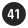

Symbol | Name |
--- |--- |
 | arrow.down.forward.and.arrow.up.backward |
 | arrow.down.right.and.arrow.up.left.circle.fill |
 | arrow.down.right.and.arrow.up.left.circle |
 | arrow.down.right.and.arrow.up.left |
 | arrow.left.and.right.righttriangle.left.righttriangle.right.fill |
 | arrow.left.and.right.righttriangle.left.righttriangle.right |
 | arrow.triangle.2.circlepath.camera.fill |
 | arrow.triangle.2.circlepath.camera |
 | arrow.triangle.2.circlepath.circle.fill |
 | arrow.triangle.2.circlepath.circle |
 | arrow.triangle.2.circlepath |
 | arrow.up.and.down.righttriangle.up.righttriangle.down.fill |
 | arrow.up.and.down.righttriangle.up.righttriangle.down |
 | arrow.up.backward.and.arrow.down.forward.circle.fill |
 | arrow.up.backward.and.arrow.down.forward.circle |
 | arrow.up.backward.and.arrow.down.forward |
 | arrow.up.left.and.arrow.down.right.circle.fill |
 | arrow.up.left.and.arrow.down.right.circle |
 | arrow.up.left.and.arrow.down.right |
 | bolt.badge.automatic.fill |
 | bolt.badge.automatic |
 | bolt.badge.checkmark.fill |
 | bolt.badge.checkmark |
 | bolt.badge.clock.fill |
 | bolt.badge.clock |
 | bolt.badge.xmark.fill |
 | bolt.badge.xmark |
 | bolt.circle.fill |
 | bolt.circle |
 | bolt.fill |
 | bolt.slash.circle.fill |
 | bolt.slash.circle |
 | bolt.slash.fill |
 | bolt.slash |
 | bolt.square.fill |
 | bolt.square |
 | bolt |
 | bolt.trianglebadge.exclamationmark.fill |
 | bolt.trianglebadge.exclamationmark |
 | camera.aperture |
 | camera.badge.clock.fill |
 | camera.badge.clock |
 | camera.badge.ellipsis.fill |
 | camera.badge.ellipsis |
 | camera.circle.fill |
 | camera.circle |
 | camera.fill |
 | camera.filters |
 | camera.macro.circle.fill |
 | camera.macro.circle |
 | camera.macro |
 | camera.metering.center.weighted.average |
 | camera.metering.center.weighted |
 | camera.metering.matrix |
 | camera.metering.multispot |
 | camera.metering.none |
 | camera.metering.partial |
 | camera.metering.spot |
 | camera.metering.unknown |
 | camera.on.rectangle.fill |
 | camera.on.rectangle |
 | camera.shutter.button.fill |
 | camera.shutter.button |
 | camera |
 | camera.viewfinder |
 | chevron.backward.circle.fill |
 | chevron.backward.circle |
 | chevron.backward |
 | chevron.down.circle.fill |
 | chevron.down.circle |
 | chevron.down |
 | chevron.forward.circle.fill |
 | chevron.forward.circle |
 | chevron.forward |
 | chevron.left.circle.fill |
 | chevron.left.circle |
 | chevron.left |
 | chevron.right.circle.fill |
 | chevron.right.circle |
 | chevron.right |
 | chevron.up.circle.fill |
 | chevron.up.circle |
 | chevron.up |
 | circle.and.line.horizontal.fill |
 | circle.and.line.horizontal |
 | circle.bottomrighthalf.checkered |
 | circle.dashed.rectangle |
 | circle.dotted.circle.fill |
 | circle.dotted.circle |
 | circle.filled.pattern.diagonalline.rectangle |
 | circle.lefthalf.filled.righthalf.striped.horizontal.inverse |
 | circle.lefthalf.filled.righthalf.striped.horizontal |
 | circle.lefthalf.striped.horizontal.inverse |
 | circle.lefthalf.striped.horizontal |
 | circle.rectangle.dashed |
 | circle.rectangle.filled.pattern.diagonalline |
 | drop.halffull |
 | f.cursive.circle.fill |
 | f.cursive.circle |
 | f.cursive |
 | ipad.rear.camera |
 | iphone.rear.camera |
 | lightspectrum.horizontal |
 | livephoto.badge.automatic |
 | livephoto.play |
 | livephoto.slash |
 | livephoto |
 | perspective |
 | photo.badge.arrow.down.fill |
 | photo.badge.arrow.down |
 | photo.badge.checkmark.fill |
 | photo.badge.checkmark |
 | photo.badge.plus.fill |
 | photo.badge.plus |
 | photo.circle.fill |
 | photo.circle |
 | photo.fill.on.rectangle.fill |
 | photo.fill |
 | photo.on.rectangle.angled |
 | photo.on.rectangle |
 | photo.stack.fill |
 | photo.stack |
 | photo |
 | plus.viewfinder |
 | plusminus.circle.fill |
 | plusminus.circle |
 | plusminus |
 | rectangle.and.arrow.up.right.and.arrow.down.left.slash |
 | rectangle.and.arrow.up.right.and.arrow.down.left |
 | righttriangle.fill |
 | righttriangle.split.diagonal.fill |
 | righttriangle.split.diagonal |
 | righttriangle |
 | scope |
 | square.2.layers.3d.bottom.filled |
 | square.2.layers.3d.fill |
 | square.2.layers.3d |
 | square.2.layers.3d.top.filled |
 | square.3.layers.3d.bottom.filled |
 | square.3.layers.3d.down.backward |
 | square.3.layers.3d.down.forward |
 | square.3.layers.3d.down.left.slash |
 | square.3.layers.3d.down.left |
 | square.3.layers.3d.down.right.slash |
 | square.3.layers.3d.down.right |
 | square.3.layers.3d.middle.filled |
 | square.3.layers.3d.slash |
 | square.3.layers.3d |
 | square.3.layers.3d.top.filled |
 | swirl.circle.righthalf.filled.inverse |
 | swirl.circle.righthalf.filled |
 | text.below.photo.fill |
 | text.below.photo |
 | trapezoid.and.line.horizontal.fill |
 | trapezoid.and.line.horizontal |
 | trapezoid.and.line.vertical.fill |
 | trapezoid.and.line.vertical |
 | 00.circle.fill |
 | 00.circle |
 | 00.square.fill |
 | 00.square |
 | 0.circle.fill |
 | 0.circle |
 | 0.square.fill |
 | 0.square |
 | 01.circle.fill |
 | 01.circle |
 | 01.square.fill |
 | 01.square |
 | 1.brakesignal |
 | 1.circle.fill |
 | 1.circle |
 | 1.lane |
 | 1.magnifyingglass |
 | 1.square.fill |
 | 1.square |
 | 02.circle.fill |
 | 02.circle |
 | 02.square.fill |
 | 02.square |
 | 2.brakesignal |
 | 2.circle.fill |
 | 2.circle |
 | 2.lane |
 | 2.square.fill |
 | 2.square |
 | 2h.circle.fill |
 | 2h.circle |
 | 2h |
 | 03.circle.fill |
 | 03.circle |
 | 03.square.fill |
 | 03.square |
 | 3.circle.fill |
 | 3.circle |
 | 3.lane |
 | 3.square.fill |
 | 3.square |
 | 04.circle.fill |
 | 04.circle |
 | 04.square.fill |
 | 04.square |
 | 4.alt.circle.fill |
 | 4.alt.circle |
 | 4.alt.square.fill |
 | 4.alt.square |
 | 4.circle.fill |
 | 4.circle |
 | 4.lane |
 | 4.square.fill |
 | 4.square |
 | 4a.circle.fill |
 | 4a.circle |
 | 4a |
 | 4h.circle.fill |
 | 4h.circle |
 | 4h |
 | 4k.tv.fill |
 | 4k.tv |
 | 4l.circle.fill |
 | 4l.circle |
 | 4l |
 | 05.circle.fill |
 | 05.circle |
 | 05.square.fill |
 | 05.square |
 | 5.circle.fill |
 | 5.circle |
 | 5.lane |
 | 5.square.fill |
 | 5.square |
 | 06.circle.fill |
 | 06.circle |
 | 06.square.fill |
 | 06.square |
 | 6.alt.circle.fill |
 | 6.alt.circle |
 | 6.alt.square.fill |
 | 6.alt.square |
 | 6.circle.fill |
 | 6.circle |
 | 6.lane |
 | 6.square.fill |
 | 6.square |
 | 07.circle.fill |
 | 07.circle |
 | 07.square.fill |
 | 07.square |
 | 7.circle.fill |
 | 7.circle |
 | 7.lane |
 | 7.square.fill |
 | 7.square |
 | 08.circle.fill |
 | 08.circle |
 | 08.square.fill |
 | 08.square |
 | 8.circle.fill |
 | 8.circle |
 | 8.lane |
 | 8.square.fill |
 | 8.square |
 | 09.circle.fill |
 | 09.circle |
 | 09.square.fill |
 | 09.square |
 | 9.alt.circle.fill |
 | 9.alt.circle |
 | 9.alt.square.fill |
 | 9.alt.square |
 | 9.circle.fill |
 | 9.circle |
 | 9.lane |
 | 9.square.fill |
 | 9.square |
 | 10.circle.fill |
 | 10.circle |
 | 10.lane |
 | 10.square.fill |
 | 10.square |
 | 11.circle.fill |
 | 11.circle |
 | 11.lane |
 | 11.square.fill |
 | 11.square |
 | 12.circle.fill |
 | 12.circle |
 | 12.lane |
 | 12.square.fill |
 | 12.square |
 | 13.circle.fill |
 | 13.circle |
 | 13.square.fill |
 | 13.square |
 | 14.circle.fill |
 | 14.circle |
 | 14.square.fill |
 | 14.square |
 | 15.circle.fill |
 | 15.circle |
 | 15.square.fill |
 | 15.square |
 | 16.circle.fill |
 | 16.circle |
 | 16.square.fill |
 | 16.square |
 | 17.circle.fill |
 | 17.circle |
 | 17.square.fill |
 | 17.square |
 | 18.circle.fill |
 | 18.circle |
 | 18.square.fill |
 | 18.square |
 | 19.circle.fill |
 | 19.circle |
 | 19.square.fill |
 | 19.square |
 | 20.circle.fill |
 | 20.circle |
 | 20.square.fill |
 | 20.square |
 | 21.circle.fill |
 | 21.circle |
 | 21.square.fill |
 | 21.square |
 | 22.circle.fill |
 | 22.circle |
 | 22.square.fill |
 | 22.square |
 | 23.circle.fill |
 | 23.circle |
 | 23.square.fill |
 | 23.square |
 | 24.circle.fill |
 | 24.circle |
 | 24.square.fill |
 | 24.square |
 | 25.circle.fill |
 | 25.circle |
 | 25.square.fill |
 | 25.square |
 | 26.circle.fill |
 | 26.circle |
 | 26.square.fill |
 | 26.square |
 | 27.circle.fill |
 | 27.circle |
 | 27.square.fill |
 | 27.square |
 | 28.circle.fill |
 | 28.circle |
 | 28.square.fill |
 | 28.square |
 | 29.circle.fill |
 | 29.circle |
 | 29.square.fill |
 | 29.square |
 | 30.circle.fill |
 | 30.circle |
 | 30.square.fill |
 | 30.square |
 | 31.circle.fill |
 | 31.circle |
 | 31.square.fill |
 | 31.square |
 | 32.circle.fill |
 | 32.circle |
 | 32.square.fill |
 | 32.square |
 | 33.circle.fill |
 | 33.circle |
 | 33.square.fill |
 | 33.square |
 | 34.circle.fill |
 | 34.circle |
 | 34.square.fill |
 | 34.square |
 | 35.circle.fill |
 | 35.circle |
 | 35.square.fill |
 | 35.square |
 | 36.circle.fill |
 | 36.circle |
 | 36.square.fill |
 | 36.square |
 | 37.circle.fill |
 | 37.circle |
 | 37.square.fill |
 | 37.square |
 | 38.circle.fill |
 | 38.circle |
 | 38.square.fill |
 | 38.square |
 | 39.circle.fill |
 | 39.circle |
 | 39.square.fill |
 | 39.square |
 | 40.circle.fill |
 | 40.circle |
 | 40.square.fill |
 | 40.square |
 | 41.circle.fill |
 | 41.circle |
 | 41.square.fill |
 | 41.square |
 | 42.circle.fill |
 | 42.circle |
 | 42.square.fill |
 | 42.square |
 | 43.circle.fill |
 | 43.circle |
 | 43.square.fill |
 | 43.square |
 | 44.circle.fill |
 | 44.circle |
 | 44.square.fill |
 | 44.square |
 | 45.circle.fill |
 | 45.circle |
 | 45.square.fill |
 | 45.square |
 | 46.circle.fill |
 | 46.circle |
 | 46.square.fill |
 | 46.square |
 | 47.circle.fill |
 | 47.circle |
 | 47.square.fill |
 | 47.square |
 | 48.circle.fill |
 | 48.circle |
 | 48.square.fill |
 | 48.square |
 | 49.circle.fill |
 | 49.circle |
 | 49.square.fill |
 | 49.square |
 | 50.circle.fill |
 | 50.circle |
 | 50.square.fill |
 | 50.square |
 | 123.rectangle.fill |
 | 123.rectangle |
 | a.circle.fill |
 | a.circle |
 | a.square.fill |
 | a.square |
 | abc |
 | abs.brakesignal.slash |
 | abs.brakesignal |
 | abs.circle.fill |
 | abs.circle |
 | abs |
 | air.conditioner.horizontal.fill |
 | air.conditioner.horizontal |
 | air.conditioner.vertical.fill |
 | air.conditioner.vertical |
 | air.purifier.fill |
 | air.purifier |
 | airplane.arrival |
 | airplane.circle.fill |
 | airplane.circle |
 | airplane.departure |
 | airplane |
 | airpod.gen3.left |
 | airpod.gen3.right |
 | airpod.left |
 | airpod.right |
 | airpodpro.left |
 | airpodpro.right |
 | airpods.chargingcase.fill |
 | airpods.chargingcase |
 | airpods.chargingcase.wireless.fill |
 | airpods.chargingcase.wireless |
 | airpods.gen3.chargingcase.wireless.fill |
 | airpods.gen3.chargingcase.wireless |
 | airpods.gen3 |
 | airpods |
 | airpodsmax |
 | airpodspro.chargingcase.wireless.fill |
 | airpodspro.chargingcase.wireless.radiowaves.left.and.right.fill |
 | airpodspro.chargingcase.wireless.radiowaves.left.and.right |
 | airpodspro.chargingcase.wireless |
 | airpodspro |
 | airport.express |
 | airport.extreme |
 | airport.extreme.tower |
 | airtag.fill |
 | airtag.radiowaves.forward.fill |
 | airtag.radiowaves.forward |
 | airtag |
 | alarm.fill |
 | alarm |
 | alarm.waves.left.and.right.fill |
 | alarm.waves.left.and.right |
 | allergens.fill |
 | allergens |
 | alt |
 | amplifier |
 | angle |
 | ant.circle.fill |
 | ant.circle |
 | ant.fill |
 | ant |
 | antenna.radiowaves.left.and.right.circle.fill |
 | antenna.radiowaves.left.and.right.circle |
 | antenna.radiowaves.left.and.right.slash |
 | antenna.radiowaves.left.and.right |
 | app.fill |
 | app |
 | applepencil.adapter.usb.c.fill |
 | applepencil.adapter.usb.c |
 | applepencil.and.scribble |
 | applepencil.gen1 |
 | applepencil.gen2 |
 | applepencil |
 | applepencil.tip |
 | appletv.fill |
 | appletv |
 | appletvremote.gen1.fill |
 | appletvremote.gen1 |
 | appletvremote.gen2.fill |
 | appletvremote.gen2 |
 | appletvremote.gen3.fill |
 | appletvremote.gen3 |
 | appletvremote.gen4.fill |
 | appletvremote.gen4 |
 | applewatch.and.arrow.forward |
 | applewatch.case.inset.filled |
 | applewatch.radiowaves.left.and.right |
 | applewatch.side.right |
 | applewatch.slash |
 | applewatch |
 | applewatch.watchface |
 | apps.ipad.landscape |
 | apps.ipad |
 | apps.iphone.badge.plus |
 | apps.iphone.landscape |
 | apps.iphone |
 | aqi.high |
 | aqi.low |
 | aqi.medium |
 | arcade.stick.and.arrow.down |
 | arcade.stick.and.arrow.left.and.arrow.right |
 | arcade.stick.and.arrow.left |
 | arcade.stick.and.arrow.right |
 | arcade.stick.and.arrow.up.and.arrow.down |
 | arcade.stick.and.arrow.up |
 | arcade.stick.console.fill |
 | arcade.stick.console |
 | arcade.stick |
 | archivebox.circle.fill |
 | archivebox.circle |
 | archivebox.fill |
 | archivebox |
 | arrow.2.squarepath |
 | arrow.3.trianglepath |
 | arrow.backward.circle.fill |
 | arrow.backward.circle |
 | arrow.backward.square.fill |
 | arrow.backward.square |
 | arrow.backward |
 | arrow.backward.to.line.circle.fill |
 | arrow.backward.to.line.circle |
 | arrow.backward.to.line |
 | arrow.circlepath |
 | arrow.clockwise.circle.fill |
 | arrow.clockwise.circle |
 | arrow.clockwise.heart.fill |
 | arrow.clockwise.heart |
 | arrow.clockwise.icloud.fill |
 | arrow.clockwise.icloud |
 | arrow.clockwise |
 | arrow.counterclockwise.circle.fill |
 | arrow.counterclockwise.circle |
 | arrow.counterclockwise.icloud.fill |
 | arrow.counterclockwise.icloud |
 | arrow.counterclockwise |
 | arrow.down.and.line.horizontal.and.arrow.up |
 | arrow.down.app.fill |
 | arrow.down.app |
 | arrow.down.applewatch |
 | arrow.down.backward.circle.fill |
 | arrow.down.backward.circle |
 | arrow.down.backward.square.fill |
 | arrow.down.backward.square |
 | arrow.down.backward |
 | arrow.down.backward.toptrailing.rectangle.fill |
 | arrow.down.backward.toptrailing.rectangle |
 | arrow.down.circle.fill |
 | arrow.down.circle |
 | arrow.down.doc.fill |
 | arrow.down.doc |
 | arrow.down.forward.and.arrow.up.backward.circle.fill |
 | arrow.down.forward.and.arrow.up.backward.circle |
 | arrow.down.forward.and.arrow.up.backward |
 | arrow.down.forward.circle.fill |
 | arrow.down.forward.circle |
 | arrow.down.forward.square.fill |
 | arrow.down.forward.square |
 | arrow.down.forward |
 | arrow.down.forward.topleading.rectangle.fill |
 | arrow.down.forward.topleading.rectangle |
 | arrow.down.heart.fill |
 | arrow.down.heart |
 | arrow.down.left.arrow.up.right.circle.fill |
 | arrow.down.left.arrow.up.right.circle |
 | arrow.down.left.arrow.up.right.square.fill |
 | arrow.down.left.arrow.up.right.square |
 | arrow.down.left.arrow.up.right |
 | arrow.down.left.circle.fill |
 | arrow.down.left.circle |
 | arrow.down.left.square.fill |
 | arrow.down.left.square |
 | arrow.down.left |
 | arrow.down.left.topright.rectangle.fill |
 | arrow.down.left.topright.rectangle |
 | arrow.down.left.video.fill |
 | arrow.down.left.video |
 | arrow.down.message.fill |
 | arrow.down.message |
 | arrow.down.right.and.arrow.up.left.circle.fill |
 | arrow.down.right.and.arrow.up.left.circle |
 | arrow.down.right.and.arrow.up.left |
 | arrow.down.right.circle.fill |
 | arrow.down.right.circle |
 | arrow.down.right.square.fill |
 | arrow.down.right.square |
 | arrow.down.right |
 | arrow.down.right.topleft.rectangle.fill |
 | arrow.down.right.topleft.rectangle |
 | arrow.down.square.fill |
 | arrow.down.square |
 | arrow.down |
 | arrow.down.to.line.circle.fill |
 | arrow.down.to.line.circle |
 | arrow.down.to.line.compact |
 | arrow.down.to.line |
 | arrow.forward.circle.fill |
 | arrow.forward.circle |
 | arrow.forward.square.fill |
 | arrow.forward.square |
 | arrow.forward |
 | arrow.forward.to.line.circle.fill |
 | arrow.forward.to.line.circle |
 | arrow.forward.to.line |
 | arrow.left.and.line.vertical.and.arrow.right |
 | arrow.left.and.right.circle.fill |
 | arrow.left.and.right.circle |
 | arrow.left.and.right.righttriangle.left.righttriangle.right.fill |
 | arrow.left.and.right.righttriangle.left.righttriangle.right |
 | arrow.left.and.right.square.fill |
 | arrow.left.and.right.square |
 | arrow.left.and.right |
 | arrow.left.and.right.text.vertical |
 | arrow.left.arrow.right.circle.fill |
 | arrow.left.arrow.right.circle |
 | arrow.left.arrow.right.square.fill |
 | arrow.left.arrow.right.square |
 | arrow.left.arrow.right |
 | arrow.left.circle.fill |
 | arrow.left.circle |
 | arrow.left.square.fill |
 | arrow.left.square |
 | arrow.left |
 | arrow.left.to.line.circle.fill |
 | arrow.left.to.line.circle |
 | arrow.left.to.line.compact |
 | arrow.left.to.line |
 | arrow.rectanglepath |
 | arrow.right.and.line.vertical.and.arrow.left |
 | arrow.right.circle.fill |
 | arrow.right.circle |
 | arrow.right.doc.on.clipboard |
 | arrow.right.square.fill |
 | arrow.right.square |
 | arrow.right |
 | arrow.right.to.line.circle.fill |
 | arrow.right.to.line.circle |
 | arrow.right.to.line.compact |
 | arrow.right.to.line |
 | arrow.triangle.2.circlepath.camera.fill |
 | arrow.triangle.2.circlepath.camera |
 | arrow.triangle.2.circlepath.circle.fill |
 | arrow.triangle.2.circlepath.circle |
 | arrow.triangle.2.circlepath.doc.on.clipboard |
 | arrow.triangle.2.circlepath |
 | arrow.triangle.branch |
 | arrow.triangle.capsulepath |
 | arrow.triangle.merge |
 | arrow.triangle.pull |
 | arrow.triangle.swap |
 | arrow.triangle.turn.up.right.circle.fill |
 | arrow.triangle.turn.up.right.circle |
 | arrow.triangle.turn.up.right.diamond.fill |
 | arrow.triangle.turn.up.right.diamond |
 | arrow.turn.down.left |
 | arrow.turn.down.right |
 | arrow.turn.left.down |
 | arrow.turn.left.up |
 | arrow.turn.right.down |
 | arrow.turn.right.up |
 | arrow.turn.up.forward.iphone.fill |
 | arrow.turn.up.forward.iphone |
 | arrow.turn.up.left |
 | arrow.turn.up.right |
 | arrow.up.and.down.and.arrow.left.and.right |
 | arrow.up.and.down.and.sparkles |
 | arrow.up.and.down.circle.fill |
 | arrow.up.and.down.circle |
 | arrow.up.and.down.righttriangle.up.righttriangle.down.fill |
 | arrow.up.and.down.righttriangle.up.righttriangle.down |
 | arrow.up.and.down.square.fill |
 | arrow.up.and.down.square |
 | arrow.up.and.down |
 | arrow.up.and.down.text.horizontal |
 | arrow.up.and.line.horizontal.and.arrow.down |
 | arrow.up.and.person.rectangle.portrait |
 | arrow.up.and.person.rectangle.turn.left |
 | arrow.up.and.person.rectangle.turn.right |
 | arrow.up.arrow.down.circle.fill |
 | arrow.up.arrow.down.circle |
 | arrow.up.arrow.down.square.fill |
 | arrow.up.arrow.down.square |
 | arrow.up.arrow.down |
 | arrow.up.backward.and.arrow.down.forward.circle.fill |
 | arrow.up.backward.and.arrow.down.forward.circle |
 | arrow.up.backward.and.arrow.down.forward |
 | arrow.up.backward.bottomtrailing.rectangle.fill |
 | arrow.up.backward.bottomtrailing.rectangle |
 | arrow.up.backward.circle.fill |
 | arrow.up.backward.circle |
 | arrow.up.backward.square.fill |
 | arrow.up.backward.square |
 | arrow.up.backward |
 | arrow.up.bin.fill |
 | arrow.up.bin |
 | arrow.up.circle.badge.clock |
 | arrow.up.circle.fill |
 | arrow.up.circle |
 | arrow.up.doc.fill |
 | arrow.up.doc.on.clipboard |
 | arrow.up.doc |
 | arrow.up.forward.app.fill |
 | arrow.up.forward.app |
 | arrow.up.forward.bottomleading.rectangle.fill |
 | arrow.up.forward.bottomleading.rectangle |
 | arrow.up.forward.circle.fill |
 | arrow.up.forward.circle |
 | arrow.up.forward.square.fill |
 | arrow.up.forward.square |
 | arrow.up.forward |
 | arrow.up.heart.fill |
 | arrow.up.heart |
 | arrow.up.left.and.arrow.down.right.circle.fill |
 | arrow.up.left.and.arrow.down.right.circle |
 | arrow.up.left.and.arrow.down.right |
 | arrow.up.left.and.down.right.and.arrow.up.right.and.down.left |
 | arrow.up.left.and.down.right.magnifyingglass |
 | arrow.up.left.arrow.down.right.circle.fill |
 | arrow.up.left.arrow.down.right.circle |
 | arrow.up.left.arrow.down.right.square.fill |
 | arrow.up.left.arrow.down.right.square |
 | arrow.up.left.arrow.down.right |
 | arrow.up.left.bottomright.rectangle.fill |
 | arrow.up.left.bottomright.rectangle |
 | arrow.up.left.circle.fill |
 | arrow.up.left.circle |
 | arrow.up.left.square.fill |
 | arrow.up.left.square |
 | arrow.up.left |
 | arrow.up.message.fill |
 | arrow.up.message |
 | arrow.up.right.bottomleft.rectangle.fill |
 | arrow.up.right.bottomleft.rectangle |
 | arrow.up.right.circle.fill |
 | arrow.up.right.circle |
 | arrow.up.right.square.fill |
 | arrow.up.right.square |
 | arrow.up.right |
 | arrow.up.right.video.fill |
 | arrow.up.right.video |
 | arrow.up.square.fill |
 | arrow.up.square |
 | arrow.up |
 | arrow.up.to.line.circle.fill |
 | arrow.up.to.line.circle |
 | arrow.up.to.line.compact |
 | arrow.up.to.line |
 | arrow.up.trash.fill |
 | arrow.up.trash |
 | arrow.uturn.backward.circle.badge.ellipsis |
 | arrow.uturn.backward.circle.fill |
 | arrow.uturn.backward.circle |
 | arrow.uturn.backward.square.fill |
 | arrow.uturn.backward.square |
 | arrow.uturn.backward |
 | arrow.uturn.down.circle.fill |
 | arrow.uturn.down.circle |
 | arrow.uturn.down.square.fill |
 | arrow.uturn.down.square |
 | arrow.uturn.down |
 | arrow.uturn.forward.circle.fill |
 | arrow.uturn.forward.circle |
 | arrow.uturn.forward.square.fill |
 | arrow.uturn.forward.square |
 | arrow.uturn.forward |
 | arrow.uturn.left.circle.badge.ellipsis |
 | arrow.uturn.left.circle.fill |
 | arrow.uturn.left.circle |
 | arrow.uturn.left.square.fill |
 | arrow.uturn.left.square |
 | arrow.uturn.left |
 | arrow.uturn.right.circle.fill |
 | arrow.uturn.right.circle |
 | arrow.uturn.right.square.fill |
 | arrow.uturn.right.square |
 | arrow.uturn.right |
 | arrow.uturn.up.circle.fill |
 | arrow.uturn.up.circle |
 | arrow.uturn.up.square.fill |
 | arrow.uturn.up.square |
 | arrow.uturn.up |
 | arrowkeys.down.filled |
 | arrowkeys.fill |
 | arrowkeys.left.filled |
 | arrowkeys.right.filled |
 | arrowkeys |
 | arrowkeys.up.filled |
 | arrowshape.backward.circle.fill |
 | arrowshape.backward.circle |
 | arrowshape.backward.fill |
 | arrowshape.backward |
 | arrowshape.bounce.forward.fill |
 | arrowshape.bounce.forward |
 | arrowshape.bounce.right.fill |
 | arrowshape.bounce.right |
 | arrowshape.down.circle.fill |
 | arrowshape.down.circle |
 | arrowshape.down.fill |
 | arrowshape.down |
 | arrowshape.forward.circle.fill |
 | arrowshape.forward.circle |
 | arrowshape.forward.fill |
 | arrowshape.forward |
 | arrowshape.left.arrowshape.right.fill |
 | arrowshape.left.arrowshape.right |
 | arrowshape.left.circle.fill |
 | arrowshape.left.circle |
 | arrowshape.left.fill |
 | arrowshape.left |
 | arrowshape.right.circle.fill |
 | arrowshape.right.circle |
 | arrowshape.right.fill |
 | arrowshape.right |
 | arrowshape.turn.up.backward.2.circle.fill |
 | arrowshape.turn.up.backward.2.circle |
 | arrowshape.turn.up.backward.2.fill |
 | arrowshape.turn.up.backward.2 |
 | arrowshape.turn.up.backward.badge.clock.fill |
 | arrowshape.turn.up.backward.badge.clock |
 | arrowshape.turn.up.backward.circle.fill |
 | arrowshape.turn.up.backward.circle |
 | arrowshape.turn.up.backward.fill |
 | arrowshape.turn.up.backward |
 | arrowshape.turn.up.forward.circle.fill |
 | arrowshape.turn.up.forward.circle |
 | arrowshape.turn.up.forward.fill |
 | arrowshape.turn.up.forward |
 | arrowshape.turn.up.left.2.circle.fill |
 | arrowshape.turn.up.left.2.circle |
 | arrowshape.turn.up.left.2.fill |
 | arrowshape.turn.up.left.2 |
 | arrowshape.turn.up.left.circle.fill |
 | arrowshape.turn.up.left.circle |
 | arrowshape.turn.up.left.fill |
 | arrowshape.turn.up.left |
 | arrowshape.turn.up.right.circle.fill |
 | arrowshape.turn.up.right.circle |
 | arrowshape.turn.up.right.fill |
 | arrowshape.turn.up.right |
 | arrowshape.up.circle.fill |
 | arrowshape.up.circle |
 | arrowshape.up.fill |
 | arrowshape.up |
 | arrowshape.zigzag.forward.fill |
 | arrowshape.zigzag.forward |
 | arrowshape.zigzag.right.fill |
 | arrowshape.zigzag.right |
 | arrowtriangle.backward.circle.fill |
 | arrowtriangle.backward.circle |
 | arrowtriangle.backward.fill |
 | arrowtriangle.backward.square.fill |
 | arrowtriangle.backward.square |
 | arrowtriangle.backward |
 | arrowtriangle.down.circle.fill |
 | arrowtriangle.down.circle |
 | arrowtriangle.down.fill |
 | arrowtriangle.down.square.fill |
 | arrowtriangle.down.square |
 | arrowtriangle.down |
 | arrowtriangle.forward.circle.fill |
 | arrowtriangle.forward.circle |
 | arrowtriangle.forward.fill |
 | arrowtriangle.forward.square.fill |
 | arrowtriangle.forward.square |
 | arrowtriangle.forward |
 | arrowtriangle.left.and.line.vertical.and.arrowtriangle.right.fill |
 | arrowtriangle.left.and.line.vertical.and.arrowtriangle.right |
 | arrowtriangle.left.circle.fill |
 | arrowtriangle.left.circle |
 | arrowtriangle.left.fill |
 | arrowtriangle.left.square.fill |
 | arrowtriangle.left.square |
 | arrowtriangle.left |
 | arrowtriangle.right.and.line.vertical.and.arrowtriangle.left.fill |
 | arrowtriangle.right.and.line.vertical.and.arrowtriangle.left |
 | arrowtriangle.right.circle.fill |
 | arrowtriangle.right.circle |
 | arrowtriangle.right.fill |
 | arrowtriangle.right.square.fill |
 | arrowtriangle.right.square |
 | arrowtriangle.right |
 | arrowtriangle.up.arrowtriangle.down.window.left |
 | arrowtriangle.up.arrowtriangle.down.window.right |
 | arrowtriangle.up.circle.fill |
 | arrowtriangle.up.circle |
 | arrowtriangle.up.fill |
 | arrowtriangle.up.square.fill |
 | arrowtriangle.up.square |
 | arrowtriangle.up |
 | aspectratio.fill |
 | aspectratio |
 | atom |
 | australiandollarsign.circle.fill |
 | australiandollarsign.circle |
 | australiandollarsign.square.fill |
 | australiandollarsign.square |
 | australiandollarsign |
 | australsign.circle.fill |
 | australsign.circle |
 | australsign.square.fill |
 | australsign.square |
 | australsign |
 | automatic.brakesignal |
 | automatic.headlight.high.beam.fill |
 | automatic.headlight.high.beam |
 | automatic.headlight.low.beam.fill |
 | automatic.headlight.low.beam |
 | autostartstop.slash |
 | autostartstop |
 | autostartstop.trianglebadge.exclamationmark |
 | av.remote.fill |
 | av.remote |
 | axle.2.driveshaft.disengaged |
 | axle.2.front.and.rear.engaged |
 | axle.2.front.disengaged |
 | axle.2.front.engaged |
 | axle.2.rear.disengaged |
 | axle.2.rear.engaged |
 | axle.2.rear.lock |
 | axle.2 |
 | b.circle.fill |
 | b.circle |
 | b.square.fill |
 | b.square |
 | backpack.circle.fill |
 | backpack.circle |
 | backpack.fill |
 | backpack |
 | backward.circle.fill |
 | backward.circle |
 | backward.end.alt.fill |
 | backward.end.alt |
 | backward.end.circle.fill |
 | backward.end.circle |
 | backward.end.fill |
 | backward.end |
 | backward.fill |
 | backward.frame.fill |
 | backward.frame |
 | backward |
 | bag.badge.minus |
 | bag.badge.plus |
 | bag.badge.questionmark |
 | bag.circle.fill |
 | bag.circle |
 | bag.fill.badge.minus |
 | bag.fill.badge.plus |
 | bag.fill.badge.questionmark |
 | bag.fill |
 | bag |
 | bahtsign.circle.fill |
 | bahtsign.circle |
 | bahtsign.square.fill |
 | bahtsign.square |
 | bahtsign |
 | balloon.2.fill |
 | balloon.2 |
 | balloon.fill |
 | balloon |
 | bandage.fill |
 | bandage |
 | banknote.fill |
 | banknote |
 | barometer |
 | baseball.circle.fill |
 | baseball.circle |
 | baseball.diamond.bases |
 | baseball.fill |
 | baseball |
 | basket.fill |
 | basket |
 | basketball.circle.fill |
 | basketball.circle |
 | basketball.fill |
 | basketball |
 | bathtub.fill |
 | bathtub |
 | battery.0percent |
 | battery.25percent |
 | battery.50percent |
 | battery.75percent |
 | battery.100percent.bolt |
 | battery.100percent.circle.fill |
 | battery.100percent.circle |
 | battery.100percent |
 | batteryblock.fill |
 | batteryblock.slash.fill |
 | batteryblock.slash |
 | batteryblock |
 | beach.umbrella.fill |
 | beach.umbrella |
 | beats.earphones |
 | beats.fit.pro.chargingcase.fill |
 | beats.fit.pro.chargingcase |
 | beats.fit.pro.left |
 | beats.fit.pro.right |
 | beats.fit.pro |
 | beats.headphones |
 | beats.powerbeats.left |
 | beats.powerbeats.right |
 | beats.powerbeats |
 | beats.powerbeats3.left |
 | beats.powerbeats3.right |
 | beats.powerbeats3 |
 | beats.powerbeatspro.chargingcase.fill |
 | beats.powerbeatspro.chargingcase |
 | beats.powerbeatspro.left |
 | beats.powerbeatspro.right |
 | beats.powerbeatspro |
 | beats.studiobud.left |
 | beats.studiobud.right |
 | beats.studiobuds.chargingcase.fill |
 | beats.studiobuds.chargingcase |
 | beats.studiobuds |
 | bed.double.circle.fill |
 | bed.double.circle |
 | bed.double.fill |
 | bed.double |
 | bell.and.waves.left.and.right.fill |
 | bell.and.waves.left.and.right |
 | bell.badge.circle.fill |
 | bell.badge.circle |
 | bell.badge.fill |
 | bell.badge |
 | bell.badge.waveform.fill |
 | bell.badge.waveform |
 | bell.circle.fill |
 | bell.circle |
 | bell.fill |
 | bell.slash.circle.fill |
 | bell.slash.circle |
 | bell.slash.fill |
 | bell.slash |
 | bell.square.fill |
 | bell.square |
 | bell |
 | bicycle.circle.fill |
 | bicycle.circle |
 | bicycle |
 | binoculars.circle.fill |
 | binoculars.circle |
 | binoculars.fill |
 | binoculars |
 | bird.circle.fill |
 | bird.circle |
 | bird.fill |
 | bird |
 | birthday.cake.fill |
 | birthday.cake |
 | bitcoinsign.circle.fill |
 | bitcoinsign.circle |
 | bitcoinsign.square.fill |
 | bitcoinsign.square |
 | bitcoinsign |
 | blinds.horizontal.closed |
 | blinds.horizontal.open |
 | blinds.vertical.closed |
 | blinds.vertical.open |
 | bold.italic.underline |
 | bold |
 | bold.underline |
 | bolt.badge.automatic.fill |
 | bolt.badge.automatic |
 | bolt.badge.checkmark.fill |
 | bolt.badge.checkmark |
 | bolt.badge.clock.fill |
 | bolt.badge.clock |
 | bolt.badge.xmark.fill |
 | bolt.badge.xmark |
 | bolt.batteryblock.fill |
 | bolt.batteryblock |
 | bolt.brakesignal |
 | bolt.car.circle.fill |
 | bolt.car.circle |
 | bolt.car.fill |
 | bolt.car |
 | bolt.circle.fill |
 | bolt.circle |
 | bolt.fill |
 | bolt.heart.fill |
 | bolt.heart |
 | bolt.horizontal.circle.fill |
 | bolt.horizontal.circle |
 | bolt.horizontal.fill |
 | bolt.horizontal.icloud.fill |
 | bolt.horizontal.icloud |
 | bolt.horizontal |
 | bolt.shield.fill |
 | bolt.shield |
 | bolt.slash.circle.fill |
 | bolt.slash.circle |
 | bolt.slash.fill |
 | bolt.slash |
 | bolt.square.fill |
 | bolt.square |
 | bolt |
 | bolt.trianglebadge.exclamationmark.fill |
 | bolt.trianglebadge.exclamationmark |
 | bonjour |
 | book.and.wrench.fill |
 | book.and.wrench |
 | book.circle.fill |
 | book.circle |
 | book.closed.circle.fill |
 | book.closed.circle |
 | book.closed.fill |
 | book.closed |
 | book.fill |
 | book |
 | bookmark.circle.fill |
 | bookmark.circle |
 | bookmark.fill |
 | bookmark.slash.fill |
 | bookmark.slash |
 | bookmark.square.fill |
 | bookmark.square |
 | bookmark |
 | books.vertical.circle.fill |
 | books.vertical.circle |
 | books.vertical.fill |
 | books.vertical |
 | brain.fill |
 | brain.filled.head.profile |
 | brain.head.profile.fill |
 | brain.head.profile |
 | brain |
 | brakesignal.dashed |
 | brakesignal |
 | brazilianrealsign.circle.fill |
 | brazilianrealsign.circle |
 | brazilianrealsign.square.fill |
 | brazilianrealsign.square |
 | brazilianrealsign |
 | briefcase.circle.fill |
 | briefcase.circle |
 | briefcase.fill |
 | briefcase |
 | bubble.left.and.bubble.right.fill |
 | bubble.left.and.bubble.right |
 | bubble.left.and.exclamationmark.bubble.right.fill |
 | bubble.left.and.exclamationmark.bubble.right |
 | bubble.left.circle.fill |
 | bubble.left.circle |
 | bubble.left.fill |
 | bubble.left |
 | bubble.middle.bottom.fill |
 | bubble.middle.bottom |
 | bubble.middle.top.fill |
 | bubble.middle.top |
 | bubble.right.circle.fill |
 | bubble.right.circle |
 | bubble.right.fill |
 | bubble.right |
 | bubbles.and.sparkles.fill |
 | bubbles.and.sparkles |
 | building.2.crop.circle.fill |
 | building.2.crop.circle |
 | building.2.fill |
 | building.2 |
 | building.fill |
 | building |
 | bus.doubledecker.fill |
 | bus.doubledecker |
 | bus.fill |
 | bus |
 | button.angledbottom.horizontal.left.fill |
 | button.angledbottom.horizontal.left |
 | button.angledbottom.horizontal.right.fill |
 | button.angledbottom.horizontal.right |
 | button.angledtop.vertical.left.fill |
 | button.angledtop.vertical.left |
 | button.angledtop.vertical.right.fill |
 | button.angledtop.vertical.right |
 | button.horizontal.fill |
 | button.horizontal |
 | button.horizontal.top.press.fill |
 | button.horizontal.top.press |
 | button.programmable.square.fill |
 | button.programmable.square |
 | button.programmable |
 | button.roundedbottom.horizontal.fill |
 | button.roundedbottom.horizontal |
 | button.roundedtop.horizontal.fill |
 | button.roundedtop.horizontal |
 | button.vertical.left.press.fill |
 | button.vertical.left.press |
 | button.vertical.right.press.fill |
 | button.vertical.right.press |
 | c.circle.fill |
 | c.circle |
 | c.square.fill |
 | c.square |
 | cabinet.fill |
 | cabinet |
 | cable.coaxial |
 | cable.connector.horizontal |
 | cable.connector |
 | cablecar.fill |
 | cablecar |
 | calendar.badge.checkmark |
 | calendar.badge.clock |
 | calendar.badge.exclamationmark |
 | calendar.badge.minus |
 | calendar.badge.plus |
 | calendar.circle.fill |
 | calendar.circle |
 | calendar |
 | camera.badge.clock.fill |
 | camera.badge.clock |
 | camera.badge.ellipsis.fill |
 | camera.badge.ellipsis |
 | camera.circle.fill |
 | camera.circle |
 | camera.fill |
 | camera.filters |
 | camera.macro.circle.fill |
 | camera.macro.circle |
 | camera.macro |
 | camera.on.rectangle.fill |
 | camera.on.rectangle |
 | camera.shutter.button.fill |
 | camera.shutter.button |
 | camera |
 | camera.viewfinder |
 | candybarphone |
 | capslock.fill |
 | capslock |
 | capsule.fill |
 | capsule.portrait.fill |
 | capsule.portrait |
 | capsule |
 | captions.bubble.fill |
 | captions.bubble |
 | car.2.fill |
 | car.2 |
 | car.circle.fill |
 | car.circle |
 | car.ferry.fill |
 | car.ferry |
 | car.fill |
 | car.front.waves.down.fill |
 | car.front.waves.down |
 | car.front.waves.up.fill |
 | car.front.waves.up |
 | car.rear.and.collision.road.lane.slash |
 | car.rear.and.collision.road.lane |
 | car.rear.and.tire.marks.slash |
 | car.rear.and.tire.marks |
 | car.rear.fill |
 | car.rear.road.lane.dashed |
 | car.rear.road.lane |
 | car.rear |
 | car.rear.waves.up.fill |
 | car.rear.waves.up |
 | car.side.air.circulate.fill |
 | car.side.air.circulate |
 | car.side.air.fresh.fill |
 | car.side.air.fresh |
 | car.side.and.exclamationmark.fill |
 | car.side.and.exclamationmark |
 | car.side.arrowtriangle.down.fill |
 | car.side.arrowtriangle.down |
 | car.side.arrowtriangle.up.arrowtriangle.down.fill |
 | car.side.arrowtriangle.up.arrowtriangle.down |
 | car.side.arrowtriangle.up.fill |
 | car.side.arrowtriangle.up |
 | car.side.fill |
 | car.side.front.open.fill |
 | car.side.front.open |
 | car.side.hill.down.fill |
 | car.side.hill.down |
 | car.side.hill.up.fill |
 | car.side.hill.up |
 | car.side.lock.fill |
 | car.side.lock.open.fill |
 | car.side.lock.open |
 | car.side.lock |
 | car.side.rear.and.collision.and.car.side.front.slash |
 | car.side.rear.and.collision.and.car.side.front |
 | car.side.rear.and.exclamationmark.and.car.side.front |
 | car.side.rear.and.wave.3.and.car.side.front |
 | car.side.rear.open.fill |
 | car.side.rear.open |
 | car.side |
 | car |
 | car.top.door.front.left.and.front.right.and.rear.left.and.rear.right.open.fill |
 | car.top.door.front.left.and.front.right.and.rear.left.and.rear.right.open |
 | car.top.door.front.left.and.front.right.and.rear.left.open.fill |
 | car.top.door.front.left.and.front.right.and.rear.left.open |
 | car.top.door.front.left.and.front.right.and.rear.right.open.fill |
 | car.top.door.front.left.and.front.right.and.rear.right.open |
 | car.top.door.front.left.and.front.right.open.fill |
 | car.top.door.front.left.and.front.right.open |
 | car.top.door.front.left.and.rear.left.and.rear.right.open.fill |
 | car.top.door.front.left.and.rear.left.and.rear.right.open |
 | car.top.door.front.left.and.rear.left.open.fill |
 | car.top.door.front.left.and.rear.left.open |
 | car.top.door.front.left.and.rear.right.open.fill |
 | car.top.door.front.left.and.rear.right.open |
 | car.top.door.front.left.open.fill |
 | car.top.door.front.left.open |
 | car.top.door.front.right.and.rear.left.and.rear.right.open.fill |
 | car.top.door.front.right.and.rear.left.and.rear.right.open |
 | car.top.door.front.right.and.rear.left.open.fill |
 | car.top.door.front.right.and.rear.left.open |
 | car.top.door.front.right.and.rear.right.open.fill |
 | car.top.door.front.right.and.rear.right.open |
 | car.top.door.front.right.open.fill |
 | car.top.door.front.right.open |
 | car.top.door.rear.left.and.rear.right.open.fill |
 | car.top.door.rear.left.and.rear.right.open |
 | car.top.door.rear.left.open.fill |
 | car.top.door.rear.left.open |
 | car.top.door.rear.right.open.fill |
 | car.top.door.rear.right.open |
 | car.top.door.sliding.left.open.fill |
 | car.top.door.sliding.left.open |
 | car.top.door.sliding.right.open.fill |
 | car.top.door.sliding.right.open |
 | car.top.frontleft.arrowtriangle.fill |
 | car.top.frontleft.arrowtriangle |
 | car.top.frontright.arrowtriangle.fill |
 | car.top.frontright.arrowtriangle |
 | car.top.lane.dashed.arrowtriangle.inward.fill |
 | car.top.lane.dashed.arrowtriangle.inward |
 | car.top.lane.dashed.badge.steeringwheel.fill |
 | car.top.lane.dashed.badge.steeringwheel |
 | car.top.lane.dashed.departure.left.fill |
 | car.top.lane.dashed.departure.left |
 | car.top.lane.dashed.departure.right.fill |
 | car.top.lane.dashed.departure.right |
 | car.top.radiowaves.front.fill |
 | car.top.radiowaves.front |
 | car.top.radiowaves.rear.fill |
 | car.top.radiowaves.rear.left.and.rear.right.fill |
 | car.top.radiowaves.rear.left.and.rear.right |
 | car.top.radiowaves.rear.left.fill |
 | car.top.radiowaves.rear.left |
 | car.top.radiowaves.rear.right.badge.exclamationmark.fill |
 | car.top.radiowaves.rear.right.badge.exclamationmark |
 | car.top.radiowaves.rear.right.badge.xmark.fill |
 | car.top.radiowaves.rear.right.badge.xmark |
 | car.top.radiowaves.rear.right.fill |
 | car.top.radiowaves.rear.right |
 | car.top.radiowaves.rear |
 | car.top.rearleft.arrowtriangle.fill |
 | car.top.rearleft.arrowtriangle |
 | car.top.rearright.arrowtriangle.fill |
 | car.top.rearright.arrowtriangle |
 | car.window.left.badge.exclamationmark |
 | car.window.left.badge.xmark |
 | car.window.left.exclamationmark |
 | car.window.left |
 | car.window.left.xmark |
 | car.window.right.badge.exclamationmark |
 | car.window.right.badge.xmark |
 | car.window.right.exclamationmark |
 | car.window.right |
 | car.window.right.xmark |
 | carbon.dioxide.cloud.fill |
 | carbon.dioxide.cloud |
 | carbon.monoxide.cloud.fill |
 | carbon.monoxide.cloud |
 | carrot.fill |
 | carrot |
 | carseat.left.1.fill |
 | carseat.left.1 |
 | carseat.left.2.fill |
 | carseat.left.2 |
 | carseat.left.3.fill |
 | carseat.left.3 |
 | carseat.left.and.heat.waves.fill |
 | carseat.left.and.heat.waves |
 | carseat.left.backrest.up.and.down.fill |
 | carseat.left.backrest.up.and.down |
 | carseat.left.fan.fill |
 | carseat.left.fan |
 | carseat.left.fill |
 | carseat.left.forward.and.backward.fill |
 | carseat.left.forward.and.backward |
 | carseat.left.massage.fill |
 | carseat.left.massage |
 | carseat.left |
 | carseat.left.up.and.down.fill |
 | carseat.left.up.and.down |
 | carseat.right.1.fill |
 | carseat.right.1 |
 | carseat.right.2.fill |
 | carseat.right.2 |
 | carseat.right.3.fill |
 | carseat.right.3 |
 | carseat.right.and.heat.waves.fill |
 | carseat.right.and.heat.waves |
 | carseat.right.backrest.up.and.down.fill |
 | carseat.right.backrest.up.and.down |
 | carseat.right.fan.fill |
 | carseat.right.fan |
 | carseat.right.fill |
 | carseat.right.forward.and.backward.fill |
 | carseat.right.forward.and.backward |
 | carseat.right.massage.fill |
 | carseat.right.massage |
 | carseat.right |
 | carseat.right.up.and.down.fill |
 | carseat.right.up.and.down |
 | cart.badge.minus |
 | cart.badge.plus |
 | cart.badge.questionmark |
 | cart.circle.fill |
 | cart.circle |
 | cart.fill.badge.minus |
 | cart.fill.badge.plus |
 | cart.fill.badge.questionmark |
 | cart.fill |
 | cart |
 | case.fill |
 | case |
 | cat.circle.fill |
 | cat.circle |
 | cat.fill |
 | cat |
 | cedisign.circle.fill |
 | cedisign.circle |
 | cedisign.square.fill |
 | cedisign.square |
 | cedisign |
 | cellularbars |
 | centsign.circle.fill |
 | centsign.circle |
 | centsign.square.fill |
 | centsign.square |
 | centsign |
 | chair.fill |
 | chair.lounge.fill |
 | chair.lounge |
 | chair |
 | chandelier.fill |
 | chandelier |
 | character.book.closed.fill |
 | character.book.closed |
 | character.bubble.fill |
 | character.bubble |
 | character.cursor.ibeam |
 | character.duployan |
 | character.magnify |
 | character.phonetic |
 | character.sutton |
 | character |
 | character.textbox |
 | chart.bar.fill |
 | chart.bar |
 | chart.xyaxis.line |
 | checkmark.applewatch |
 | checkmark.bubble.fill |
 | checkmark.bubble |
 | checkmark.circle.badge.questionmark.fill |
 | checkmark.circle.badge.questionmark |
 | checkmark.circle.badge.xmark.fill |
 | checkmark.circle.badge.xmark |
 | checkmark.circle.fill |
 | checkmark.circle |
 | checkmark.circle.trianglebadge.exclamationmark |
 | checkmark.diamond.fill |
 | checkmark.diamond |
 | checkmark.gobackward |
 | checkmark.icloud.fill |
 | checkmark.icloud |
 | checkmark.message.fill |
 | checkmark.message |
 | checkmark.rectangle.fill |
 | checkmark.rectangle.portrait.fill |
 | checkmark.rectangle.portrait |
 | checkmark.rectangle |
 | checkmark.seal.fill |
 | checkmark.seal |
 | checkmark.shield.fill |
 | checkmark.shield |
 | checkmark.square.fill |
 | checkmark.square |
 | checkmark |
 | chevron.backward.2 |
 | chevron.backward.circle.fill |
 | chevron.backward.circle |
 | chevron.backward.square.fill |
 | chevron.backward.square |
 | chevron.backward |
 | chevron.backward.to.line |
 | chevron.compact.down |
 | chevron.compact.left |
 | chevron.compact.right |
 | chevron.compact.up |
 | chevron.down.circle.fill |
 | chevron.down.circle |
 | chevron.down.square.fill |
 | chevron.down.square |
 | chevron.down |
 | chevron.forward.2 |
 | chevron.forward.circle.fill |
 | chevron.forward.circle |
 | chevron.forward.square.fill |
 | chevron.forward.square |
 | chevron.forward |
 | chevron.forward.to.line |
 | chevron.left.2 |
 | chevron.left.circle.fill |
 | chevron.left.circle |
 | chevron.left.square.fill |
 | chevron.left.square |
 | chevron.left |
 | chevron.left.to.line |
 | chevron.right.2 |
 | chevron.right.circle.fill |
 | chevron.right.circle |
 | chevron.right.square.fill |
 | chevron.right.square |
 | chevron.right |
 | chevron.right.to.line |
 | chevron.up.chevron.down |
 | chevron.up.circle.fill |
 | chevron.up.circle |
 | chevron.up.square.fill |
 | chevron.up.square |
 | chevron.up |
 | chineseyuanrenminbisign.circle.fill |
 | chineseyuanrenminbisign.circle |
 | chineseyuanrenminbisign.square.fill |
 | chineseyuanrenminbisign.square |
 | chineseyuanrenminbisign |
 | circle.and.line.horizontal.fill |
 | circle.and.line.horizontal |
 | circle.circle.fill |
 | circle.circle |
 | circle.dashed.inset.filled |
 | circle.dashed |
 | circle.fill |
 | circle.filled.ipad.fill |
 | circle.filled.ipad.landscape.fill |
 | circle.filled.ipad.landscape |
 | circle.filled.ipad |
 | circle.filled.iphone.fill |
 | circle.filled.iphone |
 | circle.grid.cross.down.filled |
 | circle.grid.cross.fill |
 | circle.grid.cross.left.filled |
 | circle.grid.cross.right.filled |
 | circle.grid.cross |
 | circle.grid.cross.up.filled |
 | circle.hexagonpath.fill |
 | circle.hexagonpath |
 | circle.lefthalf.filled.inverse |
 | circle.lefthalf.filled |
 | circle.righthalf.filled.inverse |
 | circle.righthalf.filled |
 | circle.square.fill |
 | circle.square |
 | circle |
 | clear.fill |
 | clear |
 | clipboard.fill |
 | clipboard |
 | clock.arrow.2.circlepath |
 | clock.arrow.circlepath |
 | clock.badge.checkmark.fill |
 | clock.badge.checkmark |
 | clock.badge.exclamationmark.fill |
 | clock.badge.exclamationmark |
 | clock.badge.fill |
 | clock.badge.questionmark.fill |
 | clock.badge.questionmark |
 | clock.badge |
 | clock.badge.xmark.fill |
 | clock.badge.xmark |
 | clock.circle.fill |
 | clock.circle |
 | clock.fill |
 | clock |
 | cloud.bolt.circle.fill |
 | cloud.bolt.circle |
 | cloud.bolt.fill |
 | cloud.bolt.rain.circle.fill |
 | cloud.bolt.rain.circle |
 | cloud.bolt.rain.fill |
 | cloud.bolt.rain |
 | cloud.bolt |
 | cloud.circle.fill |
 | cloud.circle |
 | cloud.drizzle.circle.fill |
 | cloud.drizzle.circle |
 | cloud.drizzle.fill |
 | cloud.drizzle |
 | cloud.fill |
 | cloud.fog.circle.fill |
 | cloud.fog.circle |
 | cloud.fog.fill |
 | cloud.fog |
 | cloud.hail.circle.fill |
 | cloud.hail.circle |
 | cloud.hail.fill |
 | cloud.hail |
 | cloud.heavyrain.circle.fill |
 | cloud.heavyrain.circle |
 | cloud.heavyrain.fill |
 | cloud.heavyrain |
 | cloud.moon.bolt.circle.fill |
 | cloud.moon.bolt.circle |
 | cloud.moon.bolt.fill |
 | cloud.moon.bolt |
 | cloud.moon.circle.fill |
 | cloud.moon.circle |
 | cloud.moon.fill |
 | cloud.moon.rain.circle.fill |
 | cloud.moon.rain.circle |
 | cloud.moon.rain.fill |
 | cloud.moon.rain |
 | cloud.moon |
 | cloud.rain.circle.fill |
 | cloud.rain.circle |
 | cloud.rain.fill |
 | cloud.rain |
 | cloud.rainbow.half.fill |
 | cloud.rainbow.half |
 | cloud.sleet.circle.fill |
 | cloud.sleet.circle |
 | cloud.sleet.fill |
 | cloud.sleet |
 | cloud.snow.circle.fill |
 | cloud.snow.circle |
 | cloud.snow.fill |
 | cloud.snow |
 | cloud.sun.bolt.circle.fill |
 | cloud.sun.bolt.circle |
 | cloud.sun.bolt.fill |
 | cloud.sun.bolt |
 | cloud.sun.circle.fill |
 | cloud.sun.circle |
 | cloud.sun.fill |
 | cloud.sun.rain.circle.fill |
 | cloud.sun.rain.circle |
 | cloud.sun.rain.fill |
 | cloud.sun.rain |
 | cloud.sun |
 | cloud |
 | coloncurrencysign.circle.fill |
 | coloncurrencysign.circle |
 | coloncurrencysign.square.fill |
 | coloncurrencysign.square |
 | coloncurrencysign |
 | comb.fill |
 | comb |
 | command.circle.fill |
 | command.circle |
 | command.square.fill |
 | command.square |
 | command |
 | compass.drawing |
 | computermouse.fill |
 | computermouse |
 | contact.sensor.fill |
 | contact.sensor |
 | contextualmenu.and.cursorarrow |
 | control |
 | cooktop.fill |
 | cooktop |
 | cpu.fill |
 | cpu |
 | creditcard.and.123 |
 | creditcard.circle.fill |
 | creditcard.circle |
 | creditcard.fill |
 | creditcard |
 | creditcard.trianglebadge.exclamationmark.fill |
 | creditcard.trianglebadge.exclamationmark |
 | creditcard.viewfinder |
 | cricket.ball.circle.fill |
 | cricket.ball.circle |
 | cricket.ball.fill |
 | cricket.ball |
 | crop.rotate |
 | crop |
 | cross.case.circle.fill |
 | cross.case.circle |
 | cross.case.fill |
 | cross.case |
 | cross.circle.fill |
 | cross.circle |
 | cross.fill |
 | cross |
 | cross.vial.fill |
 | cross.vial |
 | crown.fill |
 | crown |
 | cruzeirosign.circle.fill |
 | cruzeirosign.circle |
 | cruzeirosign.square.fill |
 | cruzeirosign.square |
 | cruzeirosign |
 | cube.fill |
 | cube |
 | cup.and.saucer.fill |
 | cup.and.saucer |
 | cursorarrow.and.square.on.square.dashed |
 | cursorarrow.click.2 |
 | cursorarrow.click.badge.clock |
 | cursorarrow.click |
 | cursorarrow.motionlines.click |
 | cursorarrow.motionlines |
 | cursorarrow.rays |
 | curtains.closed |
 | curtains.open |
 | d.circle.fill |
 | d.circle |
 | d.square.fill |
 | d.square |
 | danishkronesign.circle.fill |
 | danishkronesign.circle |
 | danishkronesign.square.fill |
 | danishkronesign.square |
 | danishkronesign |
 | decrease.indent |
 | decrease.quotelevel |
 | dehumidifier.fill |
 | dehumidifier |
 | delete.backward.fill |
 | delete.backward |
 | delete.forward.fill |
 | delete.forward |
 | delete.left.fill |
 | delete.left |
 | delete.right.fill |
 | delete.right |
 | deskclock.fill |
 | deskclock |
 | desktopcomputer.and.arrow.down |
 | desktopcomputer |
 | desktopcomputer.trianglebadge.exclamationmark |
 | deskview.fill |
 | deskview |
 | dial.high.fill |
 | dial.high |
 | dial.low.fill |
 | dial.low |
 | dial.medium.fill |
 | dial.medium |
 | diamond.fill |
 | diamond |
 | dice.fill |
 | dice |
 | die.face.1.fill |
 | die.face.1 |
 | die.face.2.fill |
 | die.face.2 |
 | die.face.3.fill |
 | die.face.3 |
 | die.face.4.fill |
 | die.face.4 |
 | die.face.5.fill |
 | die.face.5 |
 | die.face.6.fill |
 | die.face.6 |
 | digitalcrown.arrow.clockwise.fill |
 | digitalcrown.arrow.clockwise |
 | digitalcrown.arrow.counterclockwise.fill |
 | digitalcrown.arrow.counterclockwise |
 | digitalcrown.horizontal.arrow.clockwise.fill |
 | digitalcrown.horizontal.arrow.clockwise |
 | digitalcrown.horizontal.arrow.counterclockwise.fill |
 | digitalcrown.horizontal.arrow.counterclockwise |
 | digitalcrown.horizontal.press.fill |
 | digitalcrown.horizontal.press |
 | digitalcrown.press.fill |
 | digitalcrown.press |
 | dishwasher.fill |
 | dishwasher |
 | display.2 |
 | display.and.arrow.down |
 | display |
 | display.trianglebadge.exclamationmark |
 | divide.circle.fill |
 | divide.circle |
 | divide.square.fill |
 | divide.square |
 | divide |
 | doc.badge.arrow.up.fill |
 | doc.badge.arrow.up |
 | doc.badge.clock.fill |
 | doc.badge.clock |
 | doc.badge.ellipsis |
 | doc.badge.gearshape.fill |
 | doc.badge.gearshape |
 | doc.badge.plus |
 | doc.circle.fill |
 | doc.circle |
 | doc.fill.badge.ellipsis |
 | doc.fill.badge.plus |
 | doc.fill |
 | doc.on.clipboard.fill |
 | doc.on.clipboard |
 | doc.on.doc.fill |
 | doc.on.doc |
 | doc |
 | doc.text.fill |
 | doc.text.magnifyingglass |
 | doc.text |
 | doc.viewfinder.fill |
 | doc.viewfinder |
 | dog.circle.fill |
 | dog.circle |
 | dog.fill |
 | dog |
 | dollarsign.arrow.circlepath |
 | dollarsign.circle.fill |
 | dollarsign.circle |
 | dollarsign.square.fill |
 | dollarsign.square |
 | dollarsign |
 | dongsign.circle.fill |
 | dongsign.circle |
 | dongsign.square.fill |
 | dongsign.square |
 | dongsign |
 | door.french.closed |
 | door.french.open |
 | door.garage.closed |
 | door.garage.closed.trianglebadge.exclamationmark |
 | door.garage.double.bay.closed |
 | door.garage.double.bay.closed.trianglebadge.exclamationmark |
 | door.garage.double.bay.open |
 | door.garage.double.bay.open.trianglebadge.exclamationmark |
 | door.garage.open |
 | door.garage.open.trianglebadge.exclamationmark |
 | door.left.hand.closed |
 | door.left.hand.open |
 | door.right.hand.closed |
 | door.right.hand.open |
 | door.sliding.left.hand.closed |
 | door.sliding.left.hand.open |
 | door.sliding.right.hand.closed |
 | door.sliding.right.hand.open |
 | dot.arrowtriangles.up.right.down.left.circle |
 | dot.circle.and.cursorarrow |
 | dot.circle.and.hand.point.up.left.fill |
 | dot.radiowaves.forward |
 | dot.radiowaves.left.and.right |
 | dot.radiowaves.right |
 | dot.radiowaves.up.forward |
 | dpad.down.filled |
 | dpad.fill |
 | dpad.left.filled |
 | dpad.right.filled |
 | dpad |
 | dpad.up.filled |
 | drop.circle.fill |
 | drop.circle |
 | drop.degreesign.fill |
 | drop.degreesign.slash.fill |
 | drop.degreesign.slash |
 | drop.degreesign |
 | drop.fill |
 | drop.keypad.rectangle.fill |
 | drop.keypad.rectangle |
 | drop |
 | drop.transmission |
 | drop.triangle.fill |
 | drop.triangle |
 | dryer.fill |
 | dryer |
 | dumbbell.fill |
 | dumbbell |
 | e.circle.fill |
 | e.circle |
 | e.square.fill |
 | e.square |
 | ear.badge.checkmark |
 | ear.badge.waveform |
 | ear.fill |
 | ear |
 | ear.trianglebadge.exclamationmark |
 | earbuds.case.fill |
 | earbuds.case |
 | earbuds |
 | earpods |
 | eject.circle.fill |
 | eject.circle |
 | eject.fill |
 | eject |
 | ellipsis.bubble.fill |
 | ellipsis.bubble |
 | ellipsis.message.fill |
 | ellipsis.message |
 | ellipsis.vertical.bubble.fill |
 | ellipsis.vertical.bubble |
 | engine.combustion.badge.exclamationmark.fill |
 | engine.combustion.badge.exclamationmark |
 | engine.combustion.fill |
 | engine.combustion |
 | entry.lever.keypad.fill |
 | entry.lever.keypad |
 | entry.lever.keypad.trianglebadge.exclamationmark.fill |
 | entry.lever.keypad.trianglebadge.exclamationmark |
 | envelope.arrow.triangle.branch.fill |
 | envelope.arrow.triangle.branch |
 | envelope.badge.fill |
 | envelope.badge.shield.half.filled.fill |
 | envelope.badge.shield.half.filled |
 | envelope.badge |
 | envelope.circle.fill |
 | envelope.circle |
 | envelope.fill |
 | envelope.open.badge.clock |
 | envelope.open.fill |
 | envelope.open |
 | envelope |
 | equal.circle.fill |
 | equal.circle |
 | equal.square.fill |
 | equal.square |
 | equal |
 | eraser.fill |
 | eraser.line.dashed.fill |
 | eraser.line.dashed |
 | eraser |
 | escape |
 | esim.fill |
 | esim |
 | eurosign.circle.fill |
 | eurosign.circle |
 | eurosign.square.fill |
 | eurosign.square |
 | eurosign |
 | eurozonesign.circle.fill |
 | eurozonesign.circle |
 | eurozonesign.square.fill |
 | eurozonesign.square |
 | eurozonesign |
 | ev.charger.arrowtriangle.left.fill |
 | ev.charger.arrowtriangle.left |
 | ev.charger.arrowtriangle.right.fill |
 | ev.charger.arrowtriangle.right |
 | ev.charger.exclamationmark.fill |
 | ev.charger.exclamationmark |
 | ev.charger.fill |
 | ev.charger.slash.fill |
 | ev.charger.slash |
 | ev.charger |
 | ev.plug.ac.gb.t.fill |
 | ev.plug.ac.gb.t |
 | ev.plug.ac.type.1.fill |
 | ev.plug.ac.type.1 |
 | ev.plug.ac.type.2.fill |
 | ev.plug.ac.type.2 |
 | ev.plug.dc.ccs1.fill |
 | ev.plug.dc.ccs1 |
 | ev.plug.dc.ccs2.fill |
 | ev.plug.dc.ccs2 |
 | ev.plug.dc.chademo.fill |
 | ev.plug.dc.chademo |
 | ev.plug.dc.gb.t.fill |
 | ev.plug.dc.gb.t |
 | ev.plug.dc.nacs.fill |
 | ev.plug.dc.nacs |
 | exclamationmark.applewatch |
 | exclamationmark.arrow.circlepath |
 | exclamationmark.arrow.triangle.2.circlepath |
 | exclamationmark.brakesignal |
 | exclamationmark.bubble.circle.fill |
 | exclamationmark.bubble.circle |
 | exclamationmark.bubble.fill |
 | exclamationmark.bubble |
 | exclamationmark.circle.fill |
 | exclamationmark.circle |
 | exclamationmark.icloud.fill |
 | exclamationmark.icloud |
 | exclamationmark.lock.fill |
 | exclamationmark.lock |
 | exclamationmark.shield.fill |
 | exclamationmark.shield |
 | exclamationmark.square.fill |
 | exclamationmark.square |
 | exclamationmark.tirepressure |
 | exclamationmark.transmission |
 | exclamationmark.triangle.fill |
 | exclamationmark.triangle |
 | exclamationmark.warninglight.fill |
 | exclamationmark.warninglight |
 | externaldrive.badge.checkmark |
 | externaldrive.badge.exclamationmark |
 | externaldrive.badge.icloud |
 | externaldrive.badge.minus |
 | externaldrive.badge.person.crop |
 | externaldrive.badge.plus |
 | externaldrive.badge.questionmark |
 | externaldrive.badge.timemachine |
 | externaldrive.badge.wifi |
 | externaldrive.badge.xmark |
 | externaldrive.connected.to.line.below.fill |
 | externaldrive.connected.to.line.below |
 | externaldrive.fill.badge.checkmark |
 | externaldrive.fill.badge.exclamationmark |
 | externaldrive.fill.badge.icloud |
 | externaldrive.fill.badge.minus |
 | externaldrive.fill.badge.person.crop |
 | externaldrive.fill.badge.plus |
 | externaldrive.fill.badge.questionmark |
 | externaldrive.fill.badge.timemachine |
 | externaldrive.fill.badge.wifi |
 | externaldrive.fill.badge.xmark |
 | externaldrive.fill |
 | externaldrive.fill.trianglebadge.exclamationmark |
 | externaldrive |
 | externaldrive.trianglebadge.exclamationmark |
 | eye.circle.fill |
 | eye.circle |
 | eye.fill |
 | eye.slash.circle.fill |
 | eye.slash.circle |
 | eye.slash.fill |
 | eye.slash |
 | eye.square.fill |
 | eye.square |
 | eye |
 | eye.trianglebadge.exclamationmark.fill |
 | eye.trianglebadge.exclamationmark |
 | eyebrow |
 | eyedropper.full |
 | eyedropper.halffull |
 | eyedropper |
 | eyeglasses.slash |
 | eyeglasses |
 | eyes.inverse |
 | eyes |
 | f.circle.fill |
 | f.circle |
 | f.square.fill |
 | f.square |
 | face.dashed.fill |
 | face.dashed |
 | face.smiling.inverse |
 | face.smiling |
 | faceid |
 | facemask.fill |
 | facemask |
 | fan.and.light.ceiling.fill |
 | fan.and.light.ceiling |
 | fan.badge.automatic.fill |
 | fan.badge.automatic |
 | fan.ceiling.fill |
 | fan.ceiling |
 | fan.desk.fill |
 | fan.desk |
 | fan.fill |
 | fan.floor.fill |
 | fan.floor |
 | fan.oscillation.fill |
 | fan.oscillation |
 | fan.slash.fill |
 | fan.slash |
 | fan |
 | faxmachine.fill |
 | faxmachine |
 | ferry.fill |
 | ferry |
 | field.of.view.ultrawide.fill |
 | field.of.view.ultrawide |
 | field.of.view.wide.fill |
 | field.of.view.wide |
 | figure.2.and.child.holdinghands |
 | figure.2.arms.open |
 | figure.american.football |
 | figure.and.child.holdinghands |
 | figure.archery |
 | figure.arms.open |
 | figure.australian.football |
 | figure.badminton |
 | figure.barre |
 | figure.baseball |
 | figure.basketball |
 | figure.bowling |
 | figure.boxing |
 | figure.child.and.lock.fill |
 | figure.child.and.lock.open.fill |
 | figure.child.and.lock.open |
 | figure.child.and.lock |
 | figure.child.circle.fill |
 | figure.child.circle |
 | figure.child |
 | figure.climbing |
 | figure.cooldown |
 | figure.core.training |
 | figure.cricket |
 | figure.cross.training |
 | figure.curling |
 | figure.dance |
 | figure.disc.sports |
 | figure.dress.line.vertical.figure |
 | figure.elliptical |
 | figure.equestrian.sports |
 | figure.fall.circle.fill |
 | figure.fall.circle |
 | figure.fall |
 | figure.fencing |
 | figure.fishing |
 | figure.flexibility |
 | figure.golf |
 | figure.gymnastics |
 | figure.hand.cycling |
 | figure.handball |
 | figure.highintensity.intervaltraining |
 | figure.hiking |
 | figure.hockey |
 | figure.hunting |
 | figure.indoor.cycle |
 | figure.jumprope |
 | figure.kickboxing |
 | figure.lacrosse |
 | figure.martial.arts |
 | figure.mind.and.body |
 | figure.mixed.cardio |
 | figure.open.water.swim |
 | figure.outdoor.cycle |
 | figure.pickleball |
 | figure.pilates |
 | figure.play |
 | figure.pool.swim |
 | figure.racquetball |
 | figure.roll.runningpace |
 | figure.roll |
 | figure.rolling |
 | figure.rower |
 | figure.rugby |
 | figure.run.circle.fill |
 | figure.run.circle |
 | figure.run.square.stack.fill |
 | figure.run.square.stack |
 | figure.run |
 | figure.sailing |
 | figure.seated.seatbelt.and.airbag.off |
 | figure.seated.seatbelt.and.airbag.on |
 | figure.seated.seatbelt |
 | figure.seated.side.air.distribution.lower |
 | figure.seated.side.air.distribution.middle.and.lower.angled |
 | figure.seated.side.air.distribution.middle.and.lower |
 | figure.seated.side.air.distribution.middle |
 | figure.seated.side.air.distribution.upper.angled.and.lower.angled |
 | figure.seated.side.air.distribution.upper.angled.and.middle.and.lower.angled |
 | figure.seated.side.air.distribution.upper.angled.and.middle |
 | figure.seated.side.air.distribution.upper |
 | figure.seated.side.airbag.off.2 |
 | figure.seated.side.airbag.off |
 | figure.seated.side.airbag.on.2 |
 | figure.seated.side.airbag.on |
 | figure.seated.side.automatic |
 | figure.seated.side |
 | figure.seated.side.windshield.front.and.heat.waves.air.distribution.lower |
 | figure.seated.side.windshield.front.and.heat.waves.air.distribution.middle.and.lower |
 | figure.seated.side.windshield.front.and.heat.waves.air.distribution.middle |
 | figure.seated.side.windshield.front.and.heat.waves.air.distribution.upper.and.lower |
 | figure.seated.side.windshield.front.and.heat.waves.air.distribution.upper.and.middle.and.lower |
 | figure.seated.side.windshield.front.and.heat.waves.air.distribution.upper.and.middle |
 | figure.seated.side.windshield.front.and.heat.waves.air.distribution.upper |
 | figure.seated.side.windshield.front.and.heat.waves |
 | figure.skating |
 | figure.skiing.crosscountry |
 | figure.skiing.downhill |
 | figure.snowboarding |
 | figure.soccer |
 | figure.socialdance |
 | figure.softball |
 | figure.squash |
 | figure.stair.stepper |
 | figure.stairs |
 | figure.stand.line.dotted.figure.stand |
 | figure.stand |
 | figure.step.training |
 | figure.strengthtraining.functional |
 | figure.strengthtraining.traditional |
 | figure.surfing |
 | figure.table.tennis |
 | figure.taichi |
 | figure.tennis |
 | figure.track.and.field |
 | figure.volleyball |
 | figure.walk.arrival |
 | figure.walk.circle.fill |
 | figure.walk.circle |
 | figure.walk.departure |
 | figure.walk.diamond.fill |
 | figure.walk.diamond |
 | figure.walk.motion |
 | figure.walk.motion.trianglebadge.exclamationmark |
 | figure.walk |
 | figure.water.fitness |
 | figure.waterpolo |
 | figure.wave.circle.fill |
 | figure.wave.circle |
 | figure.wave |
 | figure.wrestling |
 | figure.yoga |
 | filemenu.and.cursorarrow |
 | film.circle.fill |
 | film.circle |
 | film.fill |
 | film.stack.fill |
 | film.stack |
 | film |
 | fireplace.fill |
 | fireplace |
 | firewall.fill |
 | firewall |
 | fireworks |
 | fish.circle.fill |
 | fish.circle |
 | fish.fill |
 | fish |
 | flag.2.crossed.circle.fill |
 | flag.2.crossed.circle |
 | flag.2.crossed.fill |
 | flag.2.crossed |
 | flag.and.flag.filled.crossed |
 | flag.badge.ellipsis.fill |
 | flag.badge.ellipsis |
 | flag.checkered.2.crossed |
 | flag.checkered.circle.fill |
 | flag.checkered.circle |
 | flag.checkered |
 | flag.circle.fill |
 | flag.circle |
 | flag.fill |
 | flag.filled.and.flag.crossed |
 | flag.slash.circle.fill |
 | flag.slash.circle |
 | flag.slash.fill |
 | flag.slash |
 | flag.square.fill |
 | flag.square |
 | flag |
 | flame.circle.fill |
 | flame.circle |
 | flame.fill |
 | flame |
 | flashlight.off.circle.fill |
 | flashlight.off.circle |
 | flashlight.off.fill |
 | flashlight.on.circle.fill |
 | flashlight.on.circle |
 | flashlight.on.fill |
 | flashlight.slash.circle.fill |
 | flashlight.slash.circle |
 | flashlight.slash |
 | flask.fill |
 | flask |
 | fleuron.fill |
 | fleuron |
 | flipphone |
 | florinsign.circle.fill |
 | florinsign.circle |
 | florinsign.square.fill |
 | florinsign.square |
 | florinsign |
 | fluid.brakesignal |
 | fluid.transmission |
 | folder.badge.gearshape |
 | folder.badge.minus |
 | folder.badge.person.crop |
 | folder.badge.plus |
 | folder.badge.questionmark |
 | folder.circle.fill |
 | folder.circle |
 | folder.fill.badge.gearshape |
 | folder.fill.badge.minus |
 | folder.fill.badge.person.crop |
 | folder.fill.badge.plus |
 | folder.fill.badge.questionmark |
 | folder.fill |
 | folder |
 | football.circle.fill |
 | football.circle |
 | football.fill |
 | football |
 | fork.knife.circle.fill |
 | fork.knife.circle |
 | fork.knife |
 | forward.circle.fill |
 | forward.circle |
 | forward.end.alt.fill |
 | forward.end.alt |
 | forward.end.circle.fill |
 | forward.end.circle |
 | forward.end.fill |
 | forward.end |
 | forward.fill |
 | forward.frame.fill |
 | forward.frame |
 | forward |
 | fossil.shell.fill |
 | fossil.shell |
 | francsign.circle.fill |
 | francsign.circle |
 | francsign.square.fill |
 | francsign.square |
 | francsign |
 | frying.pan.fill |
 | frying.pan |
 | fuelpump.arrowtriangle.left.fill |
 | fuelpump.arrowtriangle.left |
 | fuelpump.arrowtriangle.right.fill |
 | fuelpump.arrowtriangle.right |
 | fuelpump.circle.fill |
 | fuelpump.circle |
 | fuelpump.exclamationmark.fill |
 | fuelpump.exclamationmark |
 | fuelpump.fill |
 | fuelpump.slash.fill |
 | fuelpump.slash |
 | fuelpump |
 | function |
 | g.circle.fill |
 | g.circle |
 | g.square.fill |
 | g.square |
 | gamecontroller.fill |
 | gamecontroller |
 | gauge.open.with.lines.needle.33percent.and.arrowtriangle.from.0percent.to.50percent |
 | gauge.open.with.lines.needle.33percent.and.arrowtriangle |
 | gauge.open.with.lines.needle.33percent |
 | gauge.open.with.lines.needle.67percent.and.arrowtriangle.and.car |
 | gauge.open.with.lines.needle.67percent.and.arrowtriangle |
 | gauge.open.with.lines.needle.84percent.exclamation |
 | gauge.with.dots.needle.0percent |
 | gauge.with.dots.needle.33percent |
 | gauge.with.dots.needle.50percent |
 | gauge.with.dots.needle.67percent |
 | gauge.with.dots.needle.100percent |
 | gauge.with.dots.needle.bottom.0percent |
 | gauge.with.dots.needle.bottom.50percent.badge.minus |
 | gauge.with.dots.needle.bottom.50percent.badge.plus |
 | gauge.with.dots.needle.bottom.50percent |
 | gauge.with.dots.needle.bottom.100percent |
 | gear |
 | gearshape.2.fill |
 | gearshape.2 |
 | gearshape.arrow.triangle.2.circlepath |
 | gearshape.fill |
 | gearshape |
 | gearshift.layout.sixspeed |
 | gift.circle.fill |
 | gift.circle |
 | gift.fill |
 | gift |
 | giftcard.fill |
 | giftcard |
 | globe.americas.fill |
 | globe.americas |
 | globe.asia.australia.fill |
 | globe.asia.australia |
 | globe.badge.chevron.backward |
 | globe.central.south.asia.fill |
 | globe.central.south.asia |
 | globe.desk.fill |
 | globe.desk |
 | globe.europe.africa.fill |
 | globe.europe.africa |
 | globe |
 | glowplug |
 | gobackward.5 |
 | gobackward.10 |
 | gobackward.15 |
 | gobackward.30 |
 | gobackward.45 |
 | gobackward.60 |
 | gobackward.75 |
 | gobackward.90 |
 | gobackward.minus |
 | gobackward |
 | goforward.5 |
 | goforward.10 |
 | goforward.15 |
 | goforward.30 |
 | goforward.45 |
 | goforward.60 |
 | goforward.75 |
 | goforward.90 |
 | goforward.plus |
 | goforward |
 | graduationcap.circle.fill |
 | graduationcap.circle |
 | graduationcap.fill |
 | graduationcap |
 | greaterthan.circle.fill |
 | greaterthan.circle |
 | greaterthan.square.fill |
 | greaterthan.square |
 | greaterthan |
 | greetingcard.fill |
 | greetingcard |
 | guaranisign.circle.fill |
 | guaranisign.circle |
 | guaranisign.square.fill |
 | guaranisign.square |
 | guaranisign |
 | guitars.fill |
 | guitars |
 | gym.bag.fill |
 | gym.bag |
 | gyroscope |
 | h.circle.fill |
 | h.circle |
 | h.square.fill |
 | h.square |
 | hammer.circle.fill |
 | hammer.circle |
 | hammer.fill |
 | hammer |
 | hand.draw.fill |
 | hand.draw |
 | hand.point.down.fill |
 | hand.point.down |
 | hand.point.left.fill |
 | hand.point.left |
 | hand.point.right.fill |
 | hand.point.right |
 | hand.point.up.braille.fill |
 | hand.point.up.braille |
 | hand.point.up.fill |
 | hand.point.up.left.and.text.fill |
 | hand.point.up.left.and.text |
 | hand.point.up.left.fill |
 | hand.point.up.left |
 | hand.point.up |
 | hand.raised.app.fill |
 | hand.raised.app |
 | hand.raised.brakesignal.slash |
 | hand.raised.brakesignal |
 | hand.raised.circle.fill |
 | hand.raised.circle |
 | hand.raised.fill |
 | hand.raised.fingers.spread.fill |
 | hand.raised.fingers.spread |
 | hand.raised.slash.fill |
 | hand.raised.slash |
 | hand.raised.square.fill |
 | hand.raised.square.on.square.fill |
 | hand.raised.square.on.square |
 | hand.raised.square |
 | hand.raised |
 | hand.tap.fill |
 | hand.tap |
 | hand.thumbsdown.circle.fill |
 | hand.thumbsdown.circle |
 | hand.thumbsdown.fill |
 | hand.thumbsdown |
 | hand.thumbsup.circle.fill |
 | hand.thumbsup.circle |
 | hand.thumbsup.fill |
 | hand.thumbsup |
 | hand.wave.fill |
 | hand.wave |
 | handbag.circle.fill |
 | handbag.circle |
 | handbag.fill |
 | handbag |
 | hands.and.sparkles.fill |
 | hands.and.sparkles |
 | hands.clap.fill |
 | hands.clap |
 | hanger |
 | hare.circle.fill |
 | hare.circle |
 | hare.fill |
 | hare |
 | hazardsign.fill |
 | hazardsign |
 | headlight.daytime.fill |
 | headlight.daytime |
 | headlight.fog.fill |
 | headlight.fog |
 | headlight.high.beam.fill |
 | headlight.high.beam |
 | headlight.low.beam.fill |
 | headlight.low.beam |
 | headphones.circle.fill |
 | headphones.circle |
 | headphones |
 | hearingdevice.and.signal.meter.fill |
 | hearingdevice.and.signal.meter |
 | hearingdevice.ear.fill |
 | hearingdevice.ear |
 | heart.circle.fill |
 | heart.circle |
 | heart.fill |
 | heart |
 | heart.text.square.fill |
 | heart.text.square |
 | heat.element.windshield |
 | heat.waves |
 | heater.vertical.fill |
 | heater.vertical |
 | hexagon.fill |
 | hexagon |
 | hifireceiver.fill |
 | hifireceiver |
 | hifispeaker.2.fill |
 | hifispeaker.2 |
 | hifispeaker.and.appletv.fill |
 | hifispeaker.and.appletv |
 | hifispeaker.and.homepod.fill |
 | hifispeaker.and.homepod |
 | hifispeaker.and.homepodmini.fill |
 | hifispeaker.and.homepodmini |
 | hifispeaker.fill |
 | hifispeaker |
 | highlighter |
 | hockey.puck.circle.fill |
 | hockey.puck.circle |
 | hockey.puck.fill |
 | hockey.puck |
 | hold.brakesignal |
 | homekit |
 | homepod.2.fill |
 | homepod.2 |
 | homepod.and.appletv.fill |
 | homepod.and.appletv |
 | homepod.and.homepodmini.fill |
 | homepod.and.homepodmini |
 | homepod.fill |
 | homepod |
 | homepodmini.2.fill |
 | homepodmini.2 |
 | homepodmini.and.appletv.fill |
 | homepodmini.and.appletv |
 | homepodmini.fill |
 | homepodmini |
 | horn.blast.fill |
 | horn.blast |
 | horn.fill |
 | horn |
 | hourglass.badge.plus |
 | hourglass.bottomhalf.filled |
 | hourglass.circle.fill |
 | hourglass.circle |
 | hourglass |
 | hourglass.tophalf.filled |
 | house.and.flag.circle.fill |
 | house.and.flag.circle |
 | house.and.flag.fill |
 | house.and.flag |
 | house.circle.fill |
 | house.circle |
 | house.fill |
 | house.lodge.circle.fill |
 | house.lodge.circle |
 | house.lodge.fill |
 | house.lodge |
 | house |
 | hryvniasign.circle.fill |
 | hryvniasign.circle |
 | hryvniasign.square.fill |
 | hryvniasign.square |
 | hryvniasign |
 | humidifier.and.droplets.fill |
 | humidifier.and.droplets |
 | humidifier.fill |
 | humidifier |
 | humidity.fill |
 | humidity |
 | hurricane.circle.fill |
 | hurricane.circle |
 | hurricane |
 | i.circle.fill |
 | i.circle |
 | i.square.fill |
 | i.square |
 | icloud.and.arrow.down.fill |
 | icloud.and.arrow.down |
 | icloud.and.arrow.up.fill |
 | icloud.and.arrow.up |
 | icloud.circle.fill |
 | icloud.circle |
 | icloud.fill |
 | icloud.slash.fill |
 | icloud.slash |
 | icloud.square.fill |
 | icloud.square |
 | icloud |
 | increase.indent |
 | increase.quotelevel |
 | indianrupeesign.circle.fill |
 | indianrupeesign.circle |
 | indianrupeesign.square.fill |
 | indianrupeesign.square |
 | indianrupeesign |
 | infinity.circle.fill |
 | infinity.circle |
 | infinity |
 | info.bubble.fill |
 | info.bubble |
 | info.square.fill |
 | info.square |
 | info.windshield |
 | internaldrive.fill |
 | internaldrive |
 | ipad.and.arrow.forward |
 | ipad.and.iphone.slash |
 | ipad.and.iphone |
 | ipad.badge.play |
 | ipad.gen1.badge.play |
 | ipad.gen1.landscape.badge.play |
 | ipad.gen1.landscape |
 | ipad.gen1 |
 | ipad.gen2.badge.play |
 | ipad.gen2.landscape.badge.play |
 | ipad.gen2.landscape |
 | ipad.gen2 |
 | ipad.landscape.badge.play |
 | ipad.landscape |
 | ipad.rear.camera |
 | ipad |
 | iphone.and.arrow.forward |
 | iphone.badge.play |
 | iphone.circle.fill |
 | iphone.circle |
 | iphone.gen1.badge.play |
 | iphone.gen1.circle.fill |
 | iphone.gen1.circle |
 | iphone.gen1.landscape |
 | iphone.gen1.radiowaves.left.and.right.circle.fill |
 | iphone.gen1.radiowaves.left.and.right.circle |
 | iphone.gen1.radiowaves.left.and.right |
 | iphone.gen1.slash.circle.fill |
 | iphone.gen1.slash.circle |
 | iphone.gen1.slash |
 | iphone.gen1 |
 | iphone.gen2.badge.play |
 | iphone.gen2.circle.fill |
 | iphone.gen2.circle |
 | iphone.gen2.landscape |
 | iphone.gen2.radiowaves.left.and.right.circle.fill |
 | iphone.gen2.radiowaves.left.and.right.circle |
 | iphone.gen2.radiowaves.left.and.right |
 | iphone.gen2.slash.circle.fill |
 | iphone.gen2.slash.circle |
 | iphone.gen2.slash |
 | iphone.gen2 |
 | iphone.gen3.badge.play |
 | iphone.gen3.circle.fill |
 | iphone.gen3.circle |
 | iphone.gen3.landscape |
 | iphone.gen3.radiowaves.left.and.right.circle.fill |
 | iphone.gen3.radiowaves.left.and.right.circle |
 | iphone.gen3.radiowaves.left.and.right |
 | iphone.gen3.slash.circle.fill |
 | iphone.gen3.slash.circle |
 | iphone.gen3.slash |
 | iphone.gen3 |
 | iphone.landscape |
 | iphone.radiowaves.left.and.right.circle.fill |
 | iphone.radiowaves.left.and.right.circle |
 | iphone.radiowaves.left.and.right |
 | iphone.rear.camera |
 | iphone.slash.circle.fill |
 | iphone.slash.circle |
 | iphone.slash |
 | iphone.smartbatterycase.gen1 |
 | iphone.smartbatterycase.gen2 |
 | iphone |
 | ipod |
 | ipodshuffle.gen1 |
 | ipodshuffle.gen2 |
 | ipodshuffle.gen3 |
 | ipodshuffle.gen4 |
 | ipodtouch.landscape |
 | ipodtouch.slash |
 | ipodtouch |
 | italic |
 | ivfluid.bag.fill |
 | ivfluid.bag |
 | j.circle.fill |
 | j.circle |
 | j.square.fill |
 | j.square |
 | k.circle.fill |
 | k.circle |
 | k.square.fill |
 | k.square |
 | kashida.arabic |
 | key.fill |
 | key.horizontal.fill |
 | key.horizontal |
 | key.icloud.fill |
 | key.icloud |
 | key.radiowaves.forward.fill |
 | key.radiowaves.forward |
 | key |
 | key.viewfinder |
 | keyboard.badge.ellipsis.fill |
 | keyboard.badge.ellipsis |
 | keyboard.badge.eye.fill |
 | keyboard.badge.eye |
 | keyboard.chevron.compact.down.fill |
 | keyboard.chevron.compact.down |
 | keyboard.chevron.compact.left.fill |
 | keyboard.chevron.compact.left |
 | keyboard.fill |
 | keyboard.onehanded.left.fill |
 | keyboard.onehanded.left |
 | keyboard.onehanded.right.fill |
 | keyboard.onehanded.right |
 | keyboard |
 | kipsign.circle.fill |
 | kipsign.circle |
 | kipsign.square.fill |
 | kipsign.square |
 | kipsign |
 | kph.circle.fill |
 | kph.circle |
 | kph |
 | l.button.roundedbottom.horizontal.fill |
 | l.button.roundedbottom.horizontal |
 | l.circle.fill |
 | l.circle |
 | l.joystick.fill |
 | l.joystick.press.down.fill |
 | l.joystick.press.down |
 | l.joystick |
 | l.joystick.tilt.down.fill |
 | l.joystick.tilt.down |
 | l.joystick.tilt.left.fill |
 | l.joystick.tilt.left |
 | l.joystick.tilt.right.fill |
 | l.joystick.tilt.right |
 | l.joystick.tilt.up.fill |
 | l.joystick.tilt.up |
 | l.square.fill |
 | l.square |
 | l1.button.roundedbottom.horizontal.fill |
 | l1.button.roundedbottom.horizontal |
 | l1.circle.fill |
 | l1.circle |
 | l2.button.angledtop.vertical.left.fill |
 | l2.button.angledtop.vertical.left |
 | l2.button.roundedtop.horizontal.fill |
 | l2.button.roundedtop.horizontal |
 | l2.circle.fill |
 | l2.circle |
 | l3.button.angledbottom.horizontal.left.fill |
 | l3.button.angledbottom.horizontal.left |
 | l4.button.horizontal.fill |
 | l4.button.horizontal |
 | ladybug.circle.fill |
 | ladybug.circle |
 | ladybug.fill |
 | ladybug |
 | lamp.ceiling.fill |
 | lamp.ceiling.inverse |
 | lamp.ceiling |
 | lamp.desk.fill |
 | lamp.desk |
 | lamp.floor.fill |
 | lamp.floor |
 | lamp.table.fill |
 | lamp.table |
 | lane |
 | laptopcomputer.and.arrow.down |
 | laptopcomputer.slash |
 | laptopcomputer |
 | laptopcomputer.trianglebadge.exclamationmark |
 | larisign.circle.fill |
 | larisign.circle |
 | larisign.square.fill |
 | larisign.square |
 | larisign |
 | laser.burst |
 | lasso.badge.sparkles |
 | lasso |
 | latch.2.case.fill |
 | latch.2.case |
 | laurel.leading |
 | laurel.trailing |
 | lb.button.roundedbottom.horizontal.fill |
 | lb.button.roundedbottom.horizontal |
 | lb.circle.fill |
 | lb.circle |
 | leaf.arrow.triangle.circlepath |
 | leaf.circle.fill |
 | leaf.circle |
 | leaf.fill |
 | leaf |
 | lessthan.circle.fill |
 | lessthan.circle |
 | lessthan.square.fill |
 | lessthan.square |
 | lessthan |
 | level.fill |
 | level |
 | licenseplate.fill |
 | licenseplate |
 | lifepreserver.fill |
 | lifepreserver |
 | light.beacon.max.fill |
 | light.beacon.max |
 | light.beacon.min.fill |
 | light.beacon.min |
 | light.cylindrical.ceiling.fill |
 | light.cylindrical.ceiling.inverse |
 | light.cylindrical.ceiling |
 | light.max |
 | light.min |
 | light.overhead.left.fill |
 | light.overhead.left |
 | light.overhead.right.fill |
 | light.overhead.right |
 | light.panel.fill |
 | light.panel |
 | light.recessed.3.fill |
 | light.recessed.3.inverse |
 | light.recessed.3 |
 | light.recessed.fill |
 | light.recessed.inverse |
 | light.recessed |
 | light.ribbon.fill |
 | light.ribbon |
 | light.strip.2.fill |
 | light.strip.2 |
 | lightbulb.2.fill |
 | lightbulb.2 |
 | lightbulb.circle.fill |
 | lightbulb.circle |
 | lightbulb.fill |
 | lightbulb.led.fill |
 | lightbulb.led |
 | lightbulb.led.wide.fill |
 | lightbulb.led.wide |
 | lightbulb.max.fill |
 | lightbulb.max |
 | lightbulb.min.badge.exclamationmark.fill |
 | lightbulb.min.badge.exclamationmark |
 | lightbulb.min.fill |
 | lightbulb.min |
 | lightbulb.slash.fill |
 | lightbulb.slash |
 | lightbulb |
 | lightrail.fill |
 | lightrail |
 | lightswitch.off.fill |
 | lightswitch.off.square.fill |
 | lightswitch.off.square |
 | lightswitch.off |
 | lightswitch.on.fill |
 | lightswitch.on.square.fill |
 | lightswitch.on.square |
 | lightswitch.on |
 | line.3.horizontal.button.angledtop.vertical.right.fill |
 | line.3.horizontal.button.angledtop.vertical.right |
 | line.3.horizontal.circle.fill |
 | line.3.horizontal.circle |
 | link.badge.plus |
 | link.circle.fill |
 | link.circle |
 | link.icloud.fill |
 | link.icloud |
 | link |
 | lirasign.circle.fill |
 | lirasign.circle |
 | lirasign.square.fill |
 | lirasign.square |
 | lirasign |
 | list.bullet.circle.fill |
 | list.bullet.circle |
 | list.bullet.clipboard.fill |
 | list.bullet.clipboard |
 | list.bullet.indent |
 | list.bullet |
 | list.clipboard.fill |
 | list.clipboard |
 | list.dash |
 | list.number |
 | list.star |
 | list.triangle |
 | lizard.circle.fill |
 | lizard.circle |
 | lizard.fill |
 | lizard |
 | lm.button.horizontal.fill |
 | lm.button.horizontal |
 | location.circle.fill |
 | location.circle |
 | location.fill |
 | location.magnifyingglass |
 | location.north.circle.fill |
 | location.north.circle |
 | location.north.fill |
 | location.north.line.fill |
 | location.north.line |
 | location.north |
 | location.slash.circle.fill |
 | location.slash.circle |
 | location.slash.fill |
 | location.slash |
 | location.square.fill |
 | location.square |
 | location |
 | lock.applewatch |
 | lock.circle.fill |
 | lock.circle |
 | lock.desktopcomputer |
 | lock.display |
 | lock.doc.fill |
 | lock.doc |
 | lock.fill |
 | lock.icloud.fill |
 | lock.icloud |
 | lock.ipad |
 | lock.iphone |
 | lock.laptopcomputer |
 | lock.open.applewatch |
 | lock.open.desktopcomputer |
 | lock.open.display |
 | lock.open.fill |
 | lock.open.ipad |
 | lock.open.iphone |
 | lock.open.laptopcomputer |
 | lock.open.rotation |
 | lock.open |
 | lock.open.trianglebadge.exclamationmark.fill |
 | lock.open.trianglebadge.exclamationmark |
 | lock.rectangle.fill |
 | lock.rectangle.on.rectangle.fill |
 | lock.rectangle.on.rectangle |
 | lock.rectangle.stack.fill |
 | lock.rectangle.stack |
 | lock.rectangle |
 | lock.rotation |
 | lock.shield.fill |
 | lock.shield |
 | lock.slash.fill |
 | lock.slash |
 | lock.square.fill |
 | lock.square.stack.fill |
 | lock.square.stack |
 | lock.square |
 | lock |
 | lock.trianglebadge.exclamationmark.fill |
 | lock.trianglebadge.exclamationmark |
 | loupe |
 | lsb.button.angledbottom.horizontal.left.fill |
 | lsb.button.angledbottom.horizontal.left |
 | lt.button.roundedtop.horizontal.fill |
 | lt.button.roundedtop.horizontal |
 | lt.circle.fill |
 | lt.circle |
 | lungs.fill |
 | lungs |
 | m.circle.fill |
 | m.circle |
 | m.square.fill |
 | m.square |
 | m1.button.horizontal.fill |
 | m1.button.horizontal |
 | m2.button.horizontal.fill |
 | m2.button.horizontal |
 | m3.button.horizontal.fill |
 | m3.button.horizontal |
 | m4.button.horizontal.fill |
 | m4.button.horizontal |
 | macbook.and.ipad |
 | macbook.and.iphone |
 | macbook.gen1 |
 | macbook.gen2 |
 | macbook |
 | macmini.fill |
 | macmini |
 | macpro.gen1.fill |
 | macpro.gen1 |
 | macpro.gen2.fill |
 | macpro.gen2 |
 | macpro.gen3.fill |
 | macpro.gen3.server |
 | macpro.gen3 |
 | macstudio.fill |
 | macstudio |
 | magazine.fill |
 | magazine |
 | magicmouse.fill |
 | magicmouse |
 | magnifyingglass.circle.fill |
 | magnifyingglass.circle |
 | magnifyingglass |
 | magsafe.batterypack.fill |
 | magsafe.batterypack |
 | manatsign.circle.fill |
 | manatsign.circle |
 | manatsign.square.fill |
 | manatsign.square |
 | manatsign |
 | map.circle.fill |
 | map.circle |
 | map.fill |
 | map |
 | mappin.and.ellipse.circle.fill |
 | mappin.and.ellipse.circle |
 | mappin.and.ellipse |
 | mappin.circle.fill |
 | mappin.circle |
 | mappin.slash.circle.fill |
 | mappin.slash.circle |
 | mappin.slash |
 | mappin.square.fill |
 | mappin.square |
 | mappin |
 | medal.fill |
 | medal |
 | mediastick |
 | medical.thermometer.fill |
 | medical.thermometer |
 | megaphone.fill |
 | megaphone |
 | memorychip.fill |
 | memorychip |
 | menucard.fill |
 | menucard |
 | message.badge.circle.fill |
 | message.badge.circle |
 | message.badge.fill |
 | message.badge.filled.fill |
 | message.badge |
 | message.badge.waveform.fill |
 | message.badge.waveform |
 | message.circle.fill |
 | message.circle |
 | message.fill |
 | message |
 | metronome.fill |
 | metronome |
 | mic.and.signal.meter.fill |
 | mic.and.signal.meter |
 | mic.badge.plus |
 | mic.badge.xmark |
 | mic.circle.fill |
 | mic.circle |
 | mic.fill.badge.plus |
 | mic.fill.badge.xmark |
 | mic.fill |
 | mic.slash.circle.fill |
 | mic.slash.circle |
 | mic.slash.fill |
 | mic.slash |
 | mic.square.fill |
 | mic.square |
 | mic |
 | microbe.circle.fill |
 | microbe.circle |
 | microbe.fill |
 | microbe |
 | microwave.fill |
 | microwave |
 | millsign.circle.fill |
 | millsign.circle |
 | millsign.square.fill |
 | millsign.square |
 | millsign |
 | minus.circle.fill |
 | minus.circle |
 | minus.forwardslash.plus |
 | minus.magnifyingglass |
 | minus.plus.and.fluid.batteryblock |
 | minus.plus.batteryblock.exclamationmark.fill |
 | minus.plus.batteryblock.exclamationmark |
 | minus.plus.batteryblock.fill |
 | minus.plus.batteryblock.slash.fill |
 | minus.plus.batteryblock.slash |
 | minus.plus.batteryblock.stack.exclamationmark.fill |
 | minus.plus.batteryblock.stack.exclamationmark |
 | minus.plus.batteryblock.stack.fill |
 | minus.plus.batteryblock.stack |
 | minus.plus.batteryblock |
 | minus.rectangle.fill |
 | minus.rectangle |
 | minus.square.fill |
 | minus.square |
 | minus |
 | mirror.side.left.and.arrow.turn.down.right |
 | mirror.side.left.and.heat.waves |
 | mirror.side.left |
 | mirror.side.right.and.arrow.turn.down.left |
 | mirror.side.right.and.heat.waves |
 | mirror.side.right |
 | moon.circle.fill |
 | moon.circle |
 | moon.dust.circle.fill |
 | moon.dust.circle |
 | moon.dust.fill |
 | moon.dust |
 | moon.fill |
 | moon.haze.circle.fill |
 | moon.haze.circle |
 | moon.haze.fill |
 | moon.haze |
 | moon.stars.circle.fill |
 | moon.stars.circle |
 | moon.stars.fill |
 | moon.stars |
 | moon |
 | moonphase.first.quarter.inverse |
 | moonphase.first.quarter |
 | moonphase.full.moon.inverse |
 | moonphase.full.moon |
 | moonphase.last.quarter.inverse |
 | moonphase.last.quarter |
 | moonphase.new.moon.inverse |
 | moonphase.new.moon |
 | moonphase.waning.crescent.inverse |
 | moonphase.waning.crescent |
 | moonphase.waning.gibbous.inverse |
 | moonphase.waning.gibbous |
 | moonphase.waxing.crescent.inverse |
 | moonphase.waxing.crescent |
 | moonphase.waxing.gibbous.inverse |
 | moonphase.waxing.gibbous |
 | mount.fill |
 | mount |
 | mountain.2.circle.fill |
 | mountain.2.circle |
 | mountain.2.fill |
 | mountain.2 |
 | mouth.fill |
 | mouth |
 | move.3d |
 | movieclapper.fill |
 | movieclapper |
 | mph.circle.fill |
 | mph.circle |
 | mph |
 | mug.fill |
 | mug |
 | multiply.circle.fill |
 | multiply.circle |
 | multiply.square.fill |
 | multiply.square |
 | multiply |
 | music.mic.circle.fill |
 | music.mic.circle |
 | music.mic |
 | music.note.house.fill |
 | music.note.house |
 | music.note.tv.fill |
 | music.note.tv |
 | mustache.fill |
 | mustache |
 | n.circle.fill |
 | n.circle |
 | n.square.fill |
 | n.square |
 | nairasign.circle.fill |
 | nairasign.circle |
 | nairasign.square.fill |
 | nairasign.square |
 | nairasign |
 | network.badge.shield.half.filled |
 | network.slash |
 | network |
 | newspaper.circle.fill |
 | newspaper.circle |
 | newspaper.fill |
 | newspaper |
 | norwegiankronesign.circle.fill |
 | norwegiankronesign.circle |
 | norwegiankronesign.square.fill |
 | norwegiankronesign.square |
 | norwegiankronesign |
 | nose.fill |
 | nose |
 | nosign.app.fill |
 | nosign.app |
 | nosign |
 | note |
 | note.text.badge.plus |
 | note.text |
 | number.circle.fill |
 | number.circle |
 | number.square.fill |
 | number.square |
 | number |
 | numbersign |
 | o.circle.fill |
 | o.circle |
 | o.square.fill |
 | o.square |
 | oar.2.crossed |
 | octagon.fill |
 | octagon |
 | oilcan.fill |
 | oilcan |
 | opticaldisc.fill |
 | opticaldisc |
 | opticaldiscdrive.fill |
 | opticaldiscdrive |
 | option |
 | oval.fill |
 | oval.portrait.fill |
 | oval.portrait |
 | oval |
 | oven.fill |
 | oven |
 | p.circle.fill |
 | p.circle |
 | p.square.fill |
 | p.square |
 | p1.button.horizontal.fill |
 | p1.button.horizontal |
 | p2.button.horizontal.fill |
 | p2.button.horizontal |
 | p3.button.horizontal.fill |
 | p3.button.horizontal |
 | p4.button.horizontal.fill |
 | p4.button.horizontal |
 | paddleshifter.left.fill |
 | paddleshifter.left |
 | paddleshifter.right.fill |
 | paddleshifter.right |
 | paintbrush.fill |
 | paintbrush.pointed.fill |
 | paintbrush.pointed |
 | paintbrush |
 | paintpalette.fill |
 | paintpalette |
 | paperclip.badge.ellipsis |
 | paperclip.circle.fill |
 | paperclip.circle |
 | paperclip |
 | paperplane.circle.fill |
 | paperplane.circle |
 | paperplane.fill |
 | paperplane |
 | paragraphsign |
 | parkinglight.fill |
 | parkinglight |
 | parkingsign.brakesignal.slash |
 | parkingsign.brakesignal |
 | parkingsign.circle.fill |
 | parkingsign.circle |
 | parkingsign.radiowaves.left.and.right |
 | parkingsign.radiowaves.right.and.safetycone |
 | parkingsign.steeringwheel |
 | parkingsign |
 | party.popper.fill |
 | party.popper |
 | pause.circle.fill |
 | pause.circle |
 | pause.fill |
 | pause.rectangle.fill |
 | pause.rectangle |
 | pause |
 | pawprint.circle.fill |
 | pawprint.circle |
 | pawprint.fill |
 | pawprint |
 | pc |
 | pedal.accelerator.fill |
 | pedal.accelerator |
 | pedal.brake.fill |
 | pedal.brake |
 | pedal.clutch.fill |
 | pedal.clutch |
 | pedestrian.gate.closed |
 | pedestrian.gate.open |
 | pencil.and.outline |
 | pencil.and.ruler.fill |
 | pencil.and.ruler |
 | pencil.and.scribble |
 | pencil.circle.fill |
 | pencil.circle |
 | pencil.line |
 | pencil.slash |
 | pencil |
 | pencil.tip.crop.circle.badge.arrow.forward.fill |
 | pencil.tip.crop.circle.badge.arrow.forward |
 | pencil.tip.crop.circle.badge.minus.fill |
 | pencil.tip.crop.circle.badge.minus |
 | pencil.tip.crop.circle.badge.plus.fill |
 | pencil.tip.crop.circle.badge.plus |
 | pencil.tip.crop.circle.fill |
 | pencil.tip.crop.circle |
 | pencil.tip |
 | pentagon.fill |
 | pentagon |
 | percent |
 | person.2.badge.gearshape.fill |
 | person.2.badge.gearshape |
 | person.2.circle.fill |
 | person.2.circle |
 | person.2.crop.square.stack.fill |
 | person.2.crop.square.stack |
 | person.2.fill |
 | person.2.gobackward |
 | person.2.slash.fill |
 | person.2.slash |
 | person.2 |
 | person.2.wave.2.fill |
 | person.2.wave.2 |
 | person.3.fill |
 | person.3.sequence.fill |
 | person.3.sequence |
 | person.3 |
 | person.and.arrow.left.and.arrow.right |
 | person.and.background.dotted |
 | person.and.background.striped.horizontal |
 | person.badge.clock.fill |
 | person.badge.clock |
 | person.badge.key.fill |
 | person.badge.key |
 | person.badge.minus |
 | person.badge.plus |
 | person.badge.shield.checkmark.fill |
 | person.badge.shield.checkmark |
 | person.bust.circle.fill |
 | person.bust.circle |
 | person.bust.fill |
 | person.bust |
 | person.circle.fill |
 | person.circle |
 | person.crop.artframe |
 | person.crop.circle.badge.checkmark |
 | person.crop.circle.badge.clock.fill |
 | person.crop.circle.badge.clock |
 | person.crop.circle.badge.exclamationmark.fill |
 | person.crop.circle.badge.exclamationmark |
 | person.crop.circle.badge.fill |
 | person.crop.circle.badge.minus |
 | person.crop.circle.badge.moon.fill |
 | person.crop.circle.badge.moon |
 | person.crop.circle.badge.plus |
 | person.crop.circle.badge.questionmark.fill |
 | person.crop.circle.badge.questionmark |
 | person.crop.circle.badge |
 | person.crop.circle.badge.xmark |
 | person.crop.circle.dashed |
 | person.crop.circle.fill.badge.checkmark |
 | person.crop.circle.fill.badge.minus |
 | person.crop.circle.fill.badge.plus |
 | person.crop.circle.fill.badge.xmark |
 | person.crop.circle.fill |
 | person.crop.circle |
 | person.crop.rectangle.badge.plus.fill |
 | person.crop.rectangle.badge.plus |
 | person.crop.rectangle.fill |
 | person.crop.rectangle.stack.fill |
 | person.crop.rectangle.stack |
 | person.crop.rectangle |
 | person.crop.square.fill |
 | person.crop.square.filled.and.at.rectangle.fill |
 | person.crop.square.filled.and.at.rectangle |
 | person.crop.square |
 | person.fill.and.arrow.left.and.arrow.right |
 | person.fill.badge.minus |
 | person.fill.badge.plus |
 | person.fill.checkmark |
 | person.fill.questionmark |
 | person.fill |
 | person.fill.turn.down |
 | person.fill.turn.left |
 | person.fill.turn.right |
 | person.fill.viewfinder |
 | person.fill.xmark |
 | person.icloud.fill |
 | person.icloud |
 | person.line.dotted.person.fill |
 | person.line.dotted.person |
 | person.slash.fill |
 | person.slash |
 | person |
 | person.text.rectangle.fill |
 | person.text.rectangle |
 | person.wave.2.fill |
 | person.wave.2 |
 | personalhotspot.circle.fill |
 | personalhotspot.circle |
 | personalhotspot |
 | perspective |
 | pesetasign.circle.fill |
 | pesetasign.circle |
 | pesetasign.square.fill |
 | pesetasign.square |
 | pesetasign |
 | pesosign.circle.fill |
 | pesosign.circle |
 | pesosign.square.fill |
 | pesosign.square |
 | pesosign |
 | phone.arrow.down.left.fill |
 | phone.arrow.down.left |
 | phone.arrow.right.fill |
 | phone.arrow.right |
 | phone.arrow.up.right.circle.fill |
 | phone.arrow.up.right.circle |
 | phone.arrow.up.right.fill |
 | phone.arrow.up.right |
 | phone.badge.checkmark |
 | phone.badge.plus |
 | phone.badge.waveform.fill |
 | phone.badge.waveform |
 | phone.bubble.left.fill |
 | phone.bubble.left |
 | phone.circle.fill |
 | phone.circle |
 | phone.connection.fill |
 | phone.connection |
 | phone.down.circle.fill |
 | phone.down.circle |
 | phone.down.fill |
 | phone.down |
 | phone.down.waves.left.and.right |
 | phone.fill.badge.checkmark |
 | phone.fill.badge.plus |
 | phone.fill |
 | phone |
 | photo.artframe.circle.fill |
 | photo.artframe.circle |
 | photo.artframe |
 | photo.tv |
 | pianokeys.inverse |
 | pianokeys |
 | pill.circle.fill |
 | pill.circle |
 | pill.fill |
 | pill |
 | pills.circle.fill |
 | pills.circle |
 | pills.fill |
 | pills |
 | pin.circle.fill |
 | pin.circle |
 | pin.fill |
 | pin.slash.fill |
 | pin.slash |
 | pin.square.fill |
 | pin.square |
 | pin |
 | pipe.and.drop.fill |
 | pipe.and.drop |
 | platter.2.filled.ipad.landscape |
 | platter.2.filled.ipad |
 | platter.2.filled.iphone.landscape |
 | platter.2.filled.iphone |
 | platter.bottom.applewatch.case |
 | platter.filled.bottom.and.arrow.down.iphone |
 | platter.filled.bottom.applewatch.case |
 | platter.filled.bottom.iphone |
 | platter.filled.top.and.arrow.up.iphone |
 | platter.filled.top.applewatch.case |
 | platter.filled.top.iphone |
 | platter.top.applewatch.case |
 | play.circle.fill |
 | play.circle |
 | play.desktopcomputer |
 | play.display |
 | play.fill |
 | play.house.fill |
 | play.house |
 | play.laptopcomputer |
 | play.rectangle.fill |
 | play.rectangle |
 | play.slash.fill |
 | play.slash |
 | play.square.fill |
 | play.square.stack.fill |
 | play.square.stack |
 | play.square |
 | play |
 | play.tv.fill |
 | play.tv |
 | playpause.circle.fill |
 | playpause.circle |
 | playpause.fill |
 | playpause |
 | playstation.logo |
 | plus.bubble.fill |
 | plus.bubble |
 | plus.circle.fill |
 | plus.circle |
 | plus.forwardslash.minus |
 | plus.magnifyingglass |
 | plus.message.fill |
 | plus.message |
 | plus.rectangle.fill |
 | plus.rectangle.on.folder.fill |
 | plus.rectangle.on.folder |
 | plus.rectangle |
 | plus.square.fill |
 | plus.square |
 | plus |
 | plusminus.circle.fill |
 | plusminus.circle |
 | plusminus |
 | polishzlotysign.circle.fill |
 | polishzlotysign.circle |
 | polishzlotysign.square.fill |
 | polishzlotysign.square |
 | polishzlotysign |
 | popcorn.circle.fill |
 | popcorn.circle |
 | popcorn.fill |
 | popcorn |
 | power.circle.fill |
 | power.circle |
 | power.dotted |
 | power |
 | powercord.fill |
 | powercord |
 | poweroutlet.strip.fill |
 | poweroutlet.strip |
 | poweroutlet.type.a.fill |
 | poweroutlet.type.a.square.fill |
 | poweroutlet.type.a.square |
 | poweroutlet.type.a |
 | poweroutlet.type.b.fill |
 | poweroutlet.type.b.square.fill |
 | poweroutlet.type.b.square |
 | poweroutlet.type.b |
 | poweroutlet.type.c.fill |
 | poweroutlet.type.c.square.fill |
 | poweroutlet.type.c.square |
 | poweroutlet.type.c |
 | poweroutlet.type.d.fill |
 | poweroutlet.type.d.square.fill |
 | poweroutlet.type.d.square |
 | poweroutlet.type.d |
 | poweroutlet.type.e.fill |
 | poweroutlet.type.e.square.fill |
 | poweroutlet.type.e.square |
 | poweroutlet.type.e |
 | poweroutlet.type.f.fill |
 | poweroutlet.type.f.square.fill |
 | poweroutlet.type.f.square |
 | poweroutlet.type.f |
 | poweroutlet.type.g.fill |
 | poweroutlet.type.g.square.fill |
 | poweroutlet.type.g.square |
 | poweroutlet.type.g |
 | poweroutlet.type.h.fill |
 | poweroutlet.type.h.square.fill |
 | poweroutlet.type.h.square |
 | poweroutlet.type.h |
 | poweroutlet.type.i.fill |
 | poweroutlet.type.i.square.fill |
 | poweroutlet.type.i.square |
 | poweroutlet.type.i |
 | poweroutlet.type.j.fill |
 | poweroutlet.type.j.square.fill |
 | poweroutlet.type.j.square |
 | poweroutlet.type.j |
 | poweroutlet.type.k.fill |
 | poweroutlet.type.k.square.fill |
 | poweroutlet.type.k.square |
 | poweroutlet.type.k |
 | poweroutlet.type.l.fill |
 | poweroutlet.type.l.square.fill |
 | poweroutlet.type.l.square |
 | poweroutlet.type.l |
 | poweroutlet.type.m.fill |
 | poweroutlet.type.m.square.fill |
 | poweroutlet.type.m.square |
 | poweroutlet.type.m |
 | poweroutlet.type.n.fill |
 | poweroutlet.type.n.square.fill |
 | poweroutlet.type.n.square |
 | poweroutlet.type.n |
 | poweroutlet.type.o.fill |
 | poweroutlet.type.o.square.fill |
 | poweroutlet.type.o.square |
 | poweroutlet.type.o |
 | powerplug.fill |
 | powerplug |
 | printer.dotmatrix.fill |
 | printer.dotmatrix.filled.and.paper |
 | printer.dotmatrix |
 | printer.fill |
 | printer.filled.and.paper |
 | printer |
 | projective |
 | puzzlepiece.extension.fill |
 | puzzlepiece.extension |
 | puzzlepiece.fill |
 | puzzlepiece |
 | q.circle.fill |
 | q.circle |
 | q.square.fill |
 | q.square |
 | questionmark.bubble.fill |
 | questionmark.bubble |
 | questionmark.circle.fill |
 | questionmark.circle |
 | questionmark.folder.fill |
 | questionmark.folder |
 | questionmark.key.filled |
 | questionmark.square.fill |
 | questionmark.square |
 | questionmark.video.fill |
 | questionmark.video |
 | quote.bubble.fill |
 | quote.bubble |
 | quote.closing |
 | quote.opening |
 | quotelevel |
 | r.button.roundedbottom.horizontal.fill |
 | r.button.roundedbottom.horizontal |
 | r.circle.fill |
 | r.circle |
 | r.joystick.fill |
 | r.joystick.press.down.fill |
 | r.joystick.press.down |
 | r.joystick |
 | r.joystick.tilt.down.fill |
 | r.joystick.tilt.down |
 | r.joystick.tilt.left.fill |
 | r.joystick.tilt.left |
 | r.joystick.tilt.right.fill |
 | r.joystick.tilt.right |
 | r.joystick.tilt.up.fill |
 | r.joystick.tilt.up |
 | r.square.fill |
 | r.square |
 | r1.button.roundedbottom.horizontal.fill |
 | r1.button.roundedbottom.horizontal |
 | r1.circle.fill |
 | r1.circle |
 | r2.button.angledtop.vertical.right.fill |
 | r2.button.angledtop.vertical.right |
 | r2.button.roundedtop.horizontal.fill |
 | r2.button.roundedtop.horizontal |
 | r2.circle.fill |
 | r2.circle |
 | r3.button.angledbottom.horizontal.right.fill |
 | r3.button.angledbottom.horizontal.right |
 | r4.button.horizontal.fill |
 | r4.button.horizontal |
 | radio.fill |
 | radio |
 | rainbow |
 | rb.button.roundedbottom.horizontal.fill |
 | rb.button.roundedbottom.horizontal |
 | rb.circle.fill |
 | rb.circle |
 | record.circle.fill |
 | record.circle |
 | recordingtape.circle.fill |
 | recordingtape.circle |
 | recordingtape |
 | rectangle.3.group.bubble.left.fill |
 | rectangle.3.group.bubble.left |
 | rectangle.and.hand.point.up.left.fill |
 | rectangle.and.hand.point.up.left.filled |
 | rectangle.and.hand.point.up.left |
 | rectangle.and.paperclip |
 | rectangle.and.pencil.and.ellipsis |
 | rectangle.and.text.magnifyingglass |
 | rectangle.badge.person.crop |
 | rectangle.dashed.and.paperclip |
 | rectangle.dashed.badge.record |
 | rectangle.dashed |
 | rectangle.fill.badge.person.crop |
 | rectangle.fill.on.rectangle.fill |
 | rectangle.fill |
 | rectangle.filled.and.hand.point.up.left |
 | rectangle.inset.filled.and.person.filled |
 | rectangle.landscape.rotate |
 | rectangle.on.rectangle.button.angledtop.vertical.left.fill |
 | rectangle.on.rectangle.button.angledtop.vertical.left |
 | rectangle.on.rectangle.circle.fill |
 | rectangle.on.rectangle.circle |
 | rectangle.on.rectangle.square.fill |
 | rectangle.on.rectangle.square |
 | rectangle.on.rectangle |
 | rectangle.portrait.fill |
 | rectangle.portrait.rotate |
 | rectangle.portrait |
 | rectangle.stack.badge.person.crop.fill |
 | rectangle.stack.badge.person.crop |
 | rectangle |
 | refrigerator.fill |
 | refrigerator |
 | repeat.1.circle.fill |
 | repeat.1.circle |
 | repeat.1 |
 | repeat.circle.fill |
 | repeat.circle |
 | repeat |
 | retarder.brakesignal.and.exclamationmark |
 | retarder.brakesignal.slash |
 | retarder.brakesignal |
 | return.left |
 | return.right |
 | return |
 | rhombus.fill |
 | rhombus |
 | rm.button.horizontal.fill |
 | rm.button.horizontal |
 | road.lane.arrowtriangle.2.inward |
 | road.lanes.curved.left |
 | road.lanes.curved.right |
 | road.lanes |
 | roller.shade.closed |
 | roller.shade.open |
 | roman.shade.closed |
 | roman.shade.open |
 | rosette |
 | rotate.3d.circle.fill |
 | rotate.3d.circle |
 | rotate.3d.fill |
 | rotate.3d |
 | rotate.left.fill |
 | rotate.left |
 | rotate.right.fill |
 | rotate.right |
 | rsb.button.angledbottom.horizontal.right.fill |
 | rsb.button.angledbottom.horizontal.right |
 | rt.button.roundedtop.horizontal.fill |
 | rt.button.roundedtop.horizontal |
 | rt.circle.fill |
 | rt.circle |
 | rublesign.circle.fill |
 | rublesign.circle |
 | rublesign.square.fill |
 | rublesign.square |
 | rublesign |
 | ruler.fill |
 | ruler |
 | rupeesign.circle.fill |
 | rupeesign.circle |
 | rupeesign.square.fill |
 | rupeesign.square |
 | rupeesign |
 | s.circle.fill |
 | s.circle |
 | s.square.fill |
 | s.square |
 | sailboat.circle.fill |
 | sailboat.circle |
 | sailboat.fill |
 | sailboat |
 | scale.3d |
 | scalemass.fill |
 | scalemass |
 | scanner.fill |
 | scanner |
 | scissors.badge.ellipsis |
 | scissors.circle.fill |
 | scissors.circle |
 | scissors |
 | scooter |
 | screwdriver.fill |
 | screwdriver |
 | scribble |
 | scribble.variable |
 | scroll.fill |
 | scroll |
 | sdcard.fill |
 | sdcard |
 | seal.fill |
 | seal |
 | selection.pin.in.out |
 | sensor.fill |
 | sensor |
 | sensor.tag.radiowaves.forward.fill |
 | sensor.tag.radiowaves.forward |
 | server.rack |
 | shadow |
 | shared.with.you.slash |
 | shared.with.you |
 | shareplay.slash |
 | shareplay |
 | shekelsign.circle.fill |
 | shekelsign.circle |
 | shekelsign.square.fill |
 | shekelsign.square |
 | shekelsign |
 | shield.checkered |
 | shield.fill |
 | shield.lefthalf.filled.badge.checkmark |
 | shield.lefthalf.filled.slash |
 | shield.lefthalf.filled |
 | shield.lefthalf.filled.trianglebadge.exclamationmark |
 | shield.righthalf.filled |
 | shield.slash.fill |
 | shield.slash |
 | shield |
 | shift.fill |
 | shift |
 | shippingbox.and.arrow.backward.fill |
 | shippingbox.and.arrow.backward |
 | shippingbox.circle.fill |
 | shippingbox.circle |
 | shippingbox.fill |
 | shippingbox |
 | shoe.2.fill |
 | shoe.2 |
 | shoe.circle.fill |
 | shoe.circle |
 | shoe.fill |
 | shoe |
 | shoeprints.fill |
 | shower.fill |
 | shower.handheld.fill |
 | shower.handheld |
 | shower.sidejet.fill |
 | shower.sidejet |
 | shower |
 | shuffle.circle.fill |
 | shuffle.circle |
 | shuffle |
 | signature |
 | signpost.and.arrowtriangle.up.circle.fill |
 | signpost.and.arrowtriangle.up.circle |
 | signpost.and.arrowtriangle.up.fill |
 | signpost.and.arrowtriangle.up |
 | signpost.left.circle.fill |
 | signpost.left.circle |
 | signpost.left.fill |
 | signpost.left |
 | signpost.right.and.left.circle.fill |
 | signpost.right.and.left.circle |
 | signpost.right.and.left.fill |
 | signpost.right.and.left |
 | signpost.right.circle.fill |
 | signpost.right.circle |
 | signpost.right.fill |
 | signpost.right |
 | simcard.2.fill |
 | simcard.2 |
 | simcard.fill |
 | simcard |
 | sink.fill |
 | sink |
 | skateboard.fill |
 | skateboard |
 | skew |
 | skis.fill |
 | skis |
 | slider.horizontal.2.gobackward |
 | slider.horizontal.2.square.badge.arrow.down |
 | slider.horizontal.2.square.on.square |
 | slider.horizontal.2.square |
 | slider.horizontal.3 |
 | slider.horizontal.below.rectangle |
 | slider.horizontal.below.square.and.square.filled |
 | slider.horizontal.below.square.filled.and.square |
 | slider.vertical.3 |
 | smallcircle.filled.circle.fill |
 | smallcircle.filled.circle |
 | smartphone |
 | smoke.circle.fill |
 | smoke.circle |
 | smoke.fill |
 | smoke |
 | snowboard.fill |
 | snowboard |
 | snowflake.circle.fill |
 | snowflake.circle |
 | snowflake.road.lane.dashed |
 | snowflake.road.lane |
 | snowflake.slash |
 | snowflake |
 | soccerball.circle.fill.inverse |
 | soccerball.circle.fill |
 | soccerball.circle.inverse |
 | soccerball.circle |
 | soccerball.inverse |
 | soccerball |
 | sofa.fill |
 | sofa |
 | space |
 | sparkle.magnifyingglass |
 | sparkles |
 | sparkles.tv.fill |
 | sparkles.tv |
 | speaker.badge.exclamationmark.fill |
 | speaker.badge.exclamationmark |
 | speaker.circle.fill |
 | speaker.circle |
 | speaker.fill |
 | speaker.minus.fill |
 | speaker.minus |
 | speaker.plus.fill |
 | speaker.plus |
 | speaker.slash.circle.fill |
 | speaker.slash.circle |
 | speaker.slash.fill |
 | speaker.slash |
 | speaker.square.fill |
 | speaker.square |
 | speaker |
 | speaker.wave.1.fill |
 | speaker.wave.1 |
 | speaker.wave.2.bubble.left.fill |
 | speaker.wave.2.bubble.left |
 | speaker.wave.2.circle.fill |
 | speaker.wave.2.circle |
 | speaker.wave.2.fill |
 | speaker.wave.2 |
 | speaker.wave.3.fill |
 | speaker.wave.3 |
 | speaker.zzz.fill |
 | speaker.zzz |
 | spigot.fill |
 | spigot |
 | sportscourt.circle.fill |
 | sportscourt.circle |
 | sportscourt.fill |
 | sportscourt |
 | sprinkler.and.droplets.fill |
 | sprinkler.and.droplets |
 | sprinkler.fill |
 | sprinkler |
 | square.and.pencil.circle.fill |
 | square.and.pencil.circle |
 | square.and.pencil |
 | square.circle.fill |
 | square.circle |
 | square.dashed.inset.filled |
 | square.dashed |
 | square.fill |
 | square.grid.3x1.folder.badge.plus |
 | square.grid.3x1.folder.fill.badge.plus |
 | square.grid.3x3.bottomleft.filled |
 | square.grid.3x3.bottommiddle.filled |
 | square.grid.3x3.bottomright.filled |
 | square.grid.3x3.middle.filled |
 | square.grid.3x3.middleleft.filled |
 | square.grid.3x3.middleright.filled |
 | square.grid.3x3.topleft.filled |
 | square.grid.3x3.topmiddle.filled |
 | square.grid.3x3.topright.filled |
 | square.on.square.badge.person.crop.fill |
 | square.on.square.badge.person.crop |
 | square.split.bottomrightquarter.fill |
 | square.split.bottomrightquarter |
 | square |
 | stairs |
 | star.bubble.fill |
 | star.bubble |
 | staroflife.circle.fill |
 | staroflife.circle |
 | staroflife.fill |
 | staroflife.shield.fill |
 | staroflife.shield |
 | staroflife |
 | steeringwheel.and.heat.waves |
 | steeringwheel.and.key |
 | steeringwheel.and.liquid.wave |
 | steeringwheel.and.lock |
 | steeringwheel.arrowtriangle.left |
 | steeringwheel.arrowtriangle.right |
 | steeringwheel.badge.exclamationmark |
 | steeringwheel.circle.fill |
 | steeringwheel.circle |
 | steeringwheel.exclamationmark |
 | steeringwheel.road.lane.dashed |
 | steeringwheel.road.lane |
 | steeringwheel.slash |
 | steeringwheel |
 | sterlingsign.circle.fill |
 | sterlingsign.circle |
 | sterlingsign.square.fill |
 | sterlingsign.square |
 | sterlingsign |
 | stethoscope.circle.fill |
 | stethoscope.circle |
 | stethoscope |
 | stop.circle.fill |
 | stop.circle |
 | stop.fill |
 | stop |
 | stopwatch.fill |
 | stopwatch |
 | stove.fill |
 | stove |
 | strikethrough |
 | stroller.fill |
 | stroller |
 | studentdesk |
 | suitcase.cart.fill |
 | suitcase.cart |
 | suitcase.fill |
 | suitcase.rolling.fill |
 | suitcase.rolling |
 | suitcase |
 | sum |
 | sun.dust.circle.fill |
 | sun.dust.circle |
 | sun.dust.fill |
 | sun.dust |
 | sun.haze.circle.fill |
 | sun.haze.circle |
 | sun.haze.fill |
 | sun.haze |
 | sun.horizon.circle.fill |
 | sun.horizon.circle |
 | sun.horizon.fill |
 | sun.horizon |
 | sun.max.circle.fill |
 | sun.max.circle |
 | sun.max.fill |
 | sun.max |
 | sun.max.trianglebadge.exclamationmark.fill |
 | sun.max.trianglebadge.exclamationmark |
 | sun.min.fill |
 | sun.min |
 | sun.rain.circle.fill |
 | sun.rain.circle |
 | sun.rain.fill |
 | sun.rain |
 | sun.snow.circle.fill |
 | sun.snow.circle |
 | sun.snow.fill |
 | sun.snow |
 | sunglasses.fill |
 | sunglasses |
 | sunrise.circle.fill |
 | sunrise.circle |
 | sunrise.fill |
 | sunrise |
 | sunset.circle.fill |
 | sunset.circle |
 | sunset.fill |
 | sunset |
 | surfboard.fill |
 | surfboard |
 | suv.side.air.circulate.fill |
 | suv.side.air.circulate |
 | suv.side.air.fresh.fill |
 | suv.side.air.fresh |
 | suv.side.and.exclamationmark.fill |
 | suv.side.and.exclamationmark |
 | suv.side.arrowtriangle.down.fill |
 | suv.side.arrowtriangle.down |
 | suv.side.arrowtriangle.up.arrowtriangle.down.fill |
 | suv.side.arrowtriangle.up.arrowtriangle.down |
 | suv.side.arrowtriangle.up.fill |
 | suv.side.arrowtriangle.up |
 | suv.side.fill |
 | suv.side.front.open.fill |
 | suv.side.front.open |
 | suv.side.hill.down.fill |
 | suv.side.hill.down |
 | suv.side.hill.up.fill |
 | suv.side.hill.up |
 | suv.side.lock.fill |
 | suv.side.lock.open.fill |
 | suv.side.lock.open |
 | suv.side.lock |
 | suv.side.rear.open.fill |
 | suv.side.rear.open |
 | suv.side |
 | swatchpalette.fill |
 | swatchpalette |
 | swedishkronasign.circle.fill |
 | swedishkronasign.circle |
 | swedishkronasign.square.fill |
 | swedishkronasign.square |
 | swedishkronasign |
 | switch.programmable.fill |
 | switch.programmable.square.fill |
 | switch.programmable.square |
 | switch.programmable |
 | syringe.fill |
 | syringe |
 | t.circle.fill |
 | t.circle |
 | t.square.fill |
 | t.square |
 | table.furniture.fill |
 | table.furniture |
 | tag.circle.fill |
 | tag.circle |
 | tag.fill |
 | tag.slash.fill |
 | tag.slash |
 | tag.square.fill |
 | tag.square |
 | tag |
 | taillight.fog.fill |
 | taillight.fog |
 | takeoutbag.and.cup.and.straw.fill |
 | takeoutbag.and.cup.and.straw |
 | teddybear.fill |
 | teddybear |
 | teletype.answer.circle.fill |
 | teletype.answer.circle |
 | teletype.answer |
 | teletype.circle.fill |
 | teletype.circle |
 | teletype |
 | tengesign.circle.fill |
 | tengesign.circle |
 | tengesign.square.fill |
 | tengesign.square |
 | tengesign |
 | tennis.racket.circle.fill |
 | tennis.racket.circle |
 | tennis.racket |
 | tennisball.circle.fill |
 | tennisball.circle |
 | tennisball.fill |
 | tennisball |
 | tent.2.circle.fill |
 | tent.2.circle |
 | tent.2.fill |
 | tent.2 |
 | tent.circle.fill |
 | tent.circle |
 | tent.fill |
 | tent |
 | testtube.2 |
 | text.aligncenter |
 | text.alignleft |
 | text.alignright |
 | text.append |
 | text.book.closed.fill |
 | text.book.closed |
 | text.bubble.fill |
 | text.bubble.left.and.bubble.right.fill |
 | text.bubble.left.and.bubble.right |
 | text.bubble |
 | text.insert |
 | text.justify.leading |
 | text.justify.left |
 | text.justify.right |
 | text.justify |
 | text.justify.trailing |
 | text.line.first.and.arrowtriangle.forward |
 | text.line.last.and.arrowtriangle.forward |
 | text.magnifyingglass |
 | text.redaction |
 | text.word.spacing |
 | textformat.12 |
 | textformat.123 |
 | textformat.abc.dottedunderline |
 | textformat.abc |
 | textformat.alt |
 | textformat.size.larger |
 | textformat.size.smaller |
 | textformat.size |
 | textformat.subscript |
 | textformat.superscript |
 | textformat |
 | theatermask.and.paintbrush.fill |
 | theatermask.and.paintbrush |
 | theatermasks.circle.fill |
 | theatermasks.circle |
 | theatermasks.fill |
 | theatermasks |
 | thermometer.and.liquid.waves |
 | thermometer.brakesignal |
 | thermometer.high |
 | thermometer.low |
 | thermometer.medium.slash |
 | thermometer.medium |
 | thermometer.snowflake.circle.fill |
 | thermometer.snowflake.circle |
 | thermometer.snowflake |
 | thermometer.sun.circle.fill |
 | thermometer.sun.circle |
 | thermometer.sun.fill |
 | thermometer.sun |
 | thermometer.transmission |
 | thermometer.variable.and.figure.circle.fill |
 | thermometer.variable.and.figure.circle |
 | thermometer.variable.and.figure |
 | ticket.fill |
 | ticket |
 | timeline.selection |
 | timer.circle.fill |
 | timer.circle |
 | timer.square |
 | timer |
 | tirepressure |
 | toilet.circle.fill |
 | toilet.circle |
 | toilet.fill |
 | toilet |
 | tornado.circle.fill |
 | tornado.circle |
 | tornado |
 | tortoise.circle.fill |
 | tortoise.circle |
 | tortoise.fill |
 | tortoise |
 | touchid |
 | traction.control.tirepressure.exclamationmark |
 | traction.control.tirepressure.slash |
 | traction.control.tirepressure |
 | train.side.front.car |
 | train.side.middle.car |
 | train.side.rear.car |
 | tram.circle.fill |
 | tram.circle |
 | tram.fill |
 | tram.fill.tunnel |
 | tram |
 | transmission |
 | trapezoid.and.line.horizontal.fill |
 | trapezoid.and.line.horizontal |
 | trapezoid.and.line.vertical.fill |
 | trapezoid.and.line.vertical |
 | trash.circle.fill |
 | trash.circle |
 | trash.fill |
 | trash.slash.circle.fill |
 | trash.slash.circle |
 | trash.slash.fill |
 | trash.slash.square.fill |
 | trash.slash.square |
 | trash.slash |
 | trash.square.fill |
 | trash.square |
 | trash |
 | tray.2.fill |
 | tray.2 |
 | tray.and.arrow.down.fill |
 | tray.and.arrow.down |
 | tray.and.arrow.up.fill |
 | tray.and.arrow.up |
 | tray.circle.fill |
 | tray.circle |
 | tray.fill |
 | tray.full.fill |
 | tray.full |
 | tray |
 | tree.circle.fill |
 | tree.circle |
 | tree.fill |
 | tree |
 | triangle.circle.fill |
 | triangle.circle |
 | triangle.fill |
 | triangle |
 | triangleshape.fill |
 | triangleshape |
 | trophy.circle.fill |
 | trophy.circle |
 | trophy.fill |
 | trophy |
 | tropicalstorm.circle.fill |
 | tropicalstorm.circle |
 | tropicalstorm |
 | truck.box.badge.clock.fill |
 | truck.box.badge.clock |
 | truck.box.fill |
 | truck.box |
 | truck.pickup.side.air.circulate.fill |
 | truck.pickup.side.air.circulate |
 | truck.pickup.side.air.fresh.fill |
 | truck.pickup.side.air.fresh |
 | truck.pickup.side.and.exclamationmark.fill |
 | truck.pickup.side.and.exclamationmark |
 | truck.pickup.side.arrowtriangle.down.fill |
 | truck.pickup.side.arrowtriangle.down |
 | truck.pickup.side.arrowtriangle.up.arrowtriangle.down.fill |
 | truck.pickup.side.arrowtriangle.up.arrowtriangle.down |
 | truck.pickup.side.arrowtriangle.up.fill |
 | truck.pickup.side.arrowtriangle.up |
 | truck.pickup.side.fill |
 | truck.pickup.side.front.open.fill |
 | truck.pickup.side.front.open |
 | truck.pickup.side.hill.down.fill |
 | truck.pickup.side.hill.down |
 | truck.pickup.side.hill.up.fill |
 | truck.pickup.side.hill.up |
 | truck.pickup.side.lock.fill |
 | truck.pickup.side.lock.open.fill |
 | truck.pickup.side.lock.open |
 | truck.pickup.side.lock |
 | truck.pickup.side |
 | tshirt.circle.fill |
 | tshirt.circle |
 | tshirt.fill |
 | tshirt |
 | tugriksign.circle.fill |
 | tugriksign.circle |
 | tugriksign.square.fill |
 | tugriksign.square |
 | tugriksign |
 | tuningfork |
 | turkishlirasign.circle.fill |
 | turkishlirasign.circle |
 | turkishlirasign.square.fill |
 | turkishlirasign.square |
 | turkishlirasign |
 | tv.and.hifispeaker.fill |
 | tv.and.mediabox.fill |
 | tv.and.mediabox |
 | tv.circle.fill |
 | tv.circle |
 | tv.fill |
 | tv.inset.filled |
 | tv.slash.fill |
 | tv.slash |
 | tv |
 | u.circle.fill |
 | u.circle |
 | u.square.fill |
 | u.square |
 | umbrella.fill |
 | umbrella.percent.fill |
 | umbrella.percent |
 | umbrella |
 | underline |
 | v.circle.fill |
 | v.circle |
 | v.square.fill |
 | v.square |
 | vial.viewfinder |
 | video.badge.checkmark |
 | video.badge.ellipsis |
 | video.badge.plus |
 | video.badge.waveform.fill |
 | video.badge.waveform |
 | video.bubble.left.fill |
 | video.bubble.left |
 | video.circle.fill |
 | video.circle |
 | video.doorbell.fill |
 | video.doorbell |
 | video.fill.badge.checkmark |
 | video.fill.badge.ellipsis |
 | video.fill.badge.plus |
 | video.fill |
 | video.slash.circle.fill |
 | video.slash.circle |
 | video.slash.fill |
 | video.slash |
 | video.square.fill |
 | video.square |
 | video |
 | videoprojector.fill |
 | videoprojector |
 | viewfinder |
 | volleyball.circle.fill |
 | volleyball.circle |
 | volleyball.fill |
 | volleyball |
 | w.circle.fill |
 | w.circle |
 | w.square.fill |
 | w.square |
 | wallet.pass.fill |
 | wallet.pass |
 | wand.and.rays.inverse |
 | wand.and.rays |
 | wand.and.stars.inverse |
 | wand.and.stars |
 | warninglight.fill |
 | warninglight |
 | washer.fill |
 | washer |
 | watch.analog |
 | watchface.applewatch.case |
 | water.waves.and.arrow.down |
 | water.waves.and.arrow.down.trianglebadge.exclamationmark |
 | water.waves.and.arrow.up |
 | water.waves.slash |
 | water.waves |
 | waterbottle.fill |
 | waterbottle |
 | wave.3.backward.circle.fill |
 | wave.3.backward.circle |
 | wave.3.backward |
 | wave.3.forward.circle.fill |
 | wave.3.forward.circle |
 | wave.3.forward |
 | wave.3.left.circle.fill |
 | wave.3.left.circle |
 | wave.3.left |
 | wave.3.right.circle.fill |
 | wave.3.right.circle |
 | wave.3.right |
 | waveform.and.person.filled |
 | waveform.badge.exclamationmark |
 | waveform.badge.magnifyingglass |
 | waveform.badge.mic |
 | waveform.badge.minus |
 | waveform.badge.plus |
 | waveform.circle.fill |
 | waveform.circle |
 | waveform.path.ecg.rectangle.fill |
 | waveform.path.ecg.rectangle |
 | waveform.path.ecg |
 | waveform.slash |
 | waveform |
 | web.camera.fill |
 | web.camera |
 | wifi.circle.fill |
 | wifi.circle |
 | wifi.exclamationmark.circle.fill |
 | wifi.exclamationmark.circle |
 | wifi.exclamationmark |
 | wifi.router.fill |
 | wifi.router |
 | wifi.slash |
 | wifi.square.fill |
 | wifi.square |
 | wifi |
 | wind.circle.fill |
 | wind.circle |
 | wind.snow.circle.fill |
 | wind.snow.circle |
 | wind.snow |
 | wind |
 | window.awning.closed |
 | window.awning |
 | window.casement.closed |
 | window.casement |
 | window.ceiling.closed |
 | window.ceiling |
 | window.horizontal.closed |
 | window.horizontal |
 | window.shade.closed |
 | window.shade.open |
 | window.vertical.closed |
 | window.vertical.open |
 | windshield.front.and.fluid.and.spray |
 | windshield.front.and.heat.waves |
 | windshield.front.and.spray |
 | windshield.front.and.wiper.and.drop |
 | windshield.front.and.wiper.and.spray |
 | windshield.front.and.wiper.exclamationmark |
 | windshield.front.and.wiper.intermittent |
 | windshield.front.and.wiper |
 | windshield.rear.and.fluid.and.spray |
 | windshield.rear.and.heat.waves |
 | windshield.rear.and.spray |
 | windshield.rear.and.wiper.and.drop |
 | windshield.rear.and.wiper.and.spray |
 | windshield.rear.and.wiper.exclamationmark |
 | windshield.rear.and.wiper.intermittent |
 | windshield.rear.and.wiper |
 | wineglass.fill |
 | wineglass |
 | wonsign.circle.fill |
 | wonsign.circle |
 | wonsign.square.fill |
 | wonsign.square |
 | wonsign |
 | wrench.adjustable.fill |
 | wrench.adjustable |
 | wrench.and.screwdriver.fill |
 | wrench.and.screwdriver |
 | wrongwaysign.fill |
 | wrongwaysign |
 | x.circle.fill |
 | x.circle |
 | x.square.fill |
 | x.square |
 | x.squareroot |
 | xbox.logo |
 | xmark.bin.circle.fill |
 | xmark.bin.circle |
 | xmark.bin.fill |
 | xmark.bin |
 | xmark.circle.fill |
 | xmark.circle |
 | xmark.icloud.fill |
 | xmark.icloud |
 | xmark.seal.fill |
 | xmark.seal |
 | xmark.shield.fill |
 | xmark.shield |
 | xmark |
 | xserve.raid |
 | xserve |
 | y.circle.fill |
 | y.circle |
 | y.square.fill |
 | y.square |
 | yensign.circle.fill |
 | yensign.circle |
 | yensign.square.fill |
 | yensign.square |
 | yensign |
 | yieldsign.fill |
 | yieldsign |
 | z.circle.fill |
 | z.circle |
 | z.square.fill |
 | z.square |
 | zl.button.roundedtop.horizontal.fill |
 | zl.button.roundedtop.horizontal |
 | zr.button.roundedtop.horizontal.fill |
 | zr.button.roundedtop.horizontal |
 | arrow.down.forward.and.arrow.up.backward.circle.fill |
 |arrow.down.forward.and.arrow.up.backward.circle |
